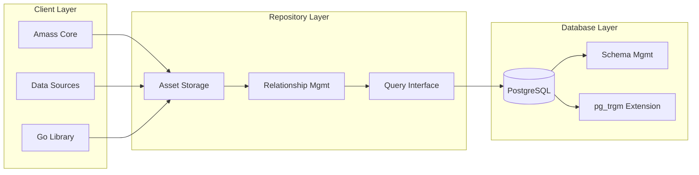

# :simple-owasp: Asset Database

The **Asset DB** is the **PostgreSQL implementation** of the database layer for the OWASP Amass framework. It provides a robust database interaction layer for storing and managing the [Open Asset Model (OAM)](https://github.com/owasp-amass/open-asset-model). While Amass supports multiple database backends (including Neo4j/Bolt , SQLite), the Asset Database specifically implements the PostgreSQL storage layer with optimized schema and query capabilities.

---

## // Overview

The [Asset Database](https://github.com/owasp-amass/asset-db) is designed to facilitate an ecosystem of scanning tools, allowing the storage of assets and their complex relationships in a structured, queryable format. This enables:

- **Persistent Asset Intel**: Store discovered assets and their relationships for long-term analysis.
- **Query Complex Relationships**: Use the [Triples Query Language](triples.md) to traverse asset relationships.
- **Track Asset Evolution**: Monitor changes in your attack surface over time.
- **Interoperability**: Provide a unified data layer for security tools.

!!! info "Open Asset Model Integration"
    The Asset Database is built around the [Open Asset Model](https://github.com/owasp-amass/open-asset-model), which defines standardized asset types, properties, and relationships. This ensures consistency across different tools and enables comprehensive attack surface mapping beyond just internet infrastructure.

---

## // Key Features

#### :octicons-database-16: Graph Database:

- **PostgreSQL Backend**: Optimized schema and extensions for PostgreSQL.
- **Graph-based Storage**: Leverages PostgreSQL's graph capabilities for relationship queries.
- **Scalable Architecture**: Designed for enterprise environments with large asset inventories.
- **Triples Query Language**: Advanced graph traversal language built for PostgreSQL.

#### :octicons-graph-16: Complex Mapping:

- **Asset Relationships**: Store and query complex relationships between different asset types.
- **Triples Query Language**: Powerful graph traversal language for complex queries.
- **Multi-triple Traversals**: Support for up to 10 triples for complex graph walks.
- **Temporal Tracking**: Track when relationships were discovered and their confidence levels.
- **Attribute Filtering**: Filter results by asset and relation attributes.

#### :octicons-tools-16: System Integration:

- **Command Line Interface**: Subcommand querying via `amass assoc`.
- **Database Interface**: Direct database access for programmatic integration.
- **Modular Architecture**: Extensible design supporting custom integrations.
- **Export Capabilities**: Export data in multiple formats for analysis and reporting.

---

## // Supported Asset Types

The Asset Database supports all asset types defined in the [Open Asset Model](../open_asset_model/index.md). For detailed information about each asset type, see [Assets](../open_asset_model/assets/index.md).

---

## //Architecture


The Asset Database follows a **layered architecture pattern** that provides exceptional flexibility, scalability, and maintainability. This design pattern separates concerns into distinct layers, each with specific responsibilities and clear interfaces between them.

---


---

#### :material-console: **Client Layer** >> Interface & Integration

> This layer handles user interactions and data ingestion:

- **Amass Core**: Primary enumeration engine and discovery framework.

- **Data Sources**: External feeds and tools that populate the database.

- **Go Library**: Programmatic access for custom integrations and automation.

#### :material-spider-web: **Repository Layer** >> Data Abstraction & Logic

> This layer implements the core data operations and query logic:

- **Asset Storage**: CRUD operations for all asset types (FQDNs, IPs, Organizations, etc.).

- **Relationship Management**: Graph relationship storage and traversal logic.

- **Query Interface**: Triples Query Language implementation and query processing.

- **Abstraction**: Provides a consistent entry point for data operations and removed underlying database complexity.

#### :material-table-column: **Database Layer** >> Data Persistence & Storage

> This layer handles data persistence and optimization:

  - **PostgreSQL**: Primary database with optimized schema for graph relationships.

  - **Schema Management**: Table structures and indexing for efficient queries.

  - **`pg_trgm`**: Trigram indexing for fuzzy string matching and search.

---

#### Why This Works Well:

**>> Separation of Concerns**

>Each layer has a specific responsibility:

- **Client Layer**: User interface and data ingestion

- **Repository Layer**: Data abstraction and business logic

- **Database Layer**: Data persistence and storage

> This separation enables independent development and testing.

#### **>> Multiple Integration Patterns**
>The system supports various access methods:

- **Command Line**: Direct querying via `amass assoc` command

- **Go Library**: Programmatic access for custom applications

- **Database**: Direct SQL access for advanced analytics

#### **>> Database Flexibility**
>The Repository Layer abstracts database details, enabling:

- **PostgreSQL**: Primary implementation with graph capabilities.

- **Neo4j**: Graph database for complex relationships

- **SQLite**: Lightweight option for basic deployments

#### **>> Modular Design**

>The layered architecture provides:

- **Independent Development**: Teams can work on different layers
- **Clear Interfaces**: Well-defined boundaries between components
- **Extensible Structure**: Easy to add new features or modify existing ones

#### **>> Maintainability**
>Clear layer boundaries enable:

- **Isolated Testing**: Each layer can be tested independently
- **Problem Isolation**: Issues can be traced to specific layers
- **Independent Updates**: Changes in one layer don't affect others

---

This design means you can:

- **Start Simple**: Begin with basic enumeration and add more later
- **Grow When Needed**: Add more data sources as you need them
- **Use Your Tools**: Work with your existing security setup
- **Build Your Own**: Create custom tools if you want to
- **Keep It Working**: Make changes without breaking everything

---

## // Common Use Cases

#### >> Security Research:

- **Find Assets**: Discover domains, IPs, and other assets you didn't know about
- **Track Changes**: See what's new or changed in your target's infrastructure
- **Map Relationships**: Understand how different assets connect to each other

#### >> Bug Bounty & Penetration Testing:

- **Scope Discovery**: Find all the assets in your target's attack surface
- **Asset Tracking**: Keep track of what you've found during your research
- **Relationship Mapping**: See how assets relate to each other for better targeting

#### >> Security Analysis:

- **Asset Inventory**: Build a complete picture of what you're analyzing
- **Historical Tracking**: See what assets were discovered when
- **Data Export**: Get your findings out for further analysis
```


