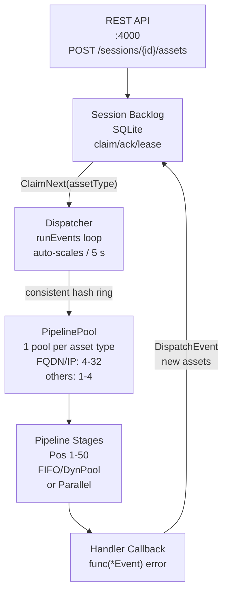

# :simple-owasp: Contributing to OWASP Amass

Welcome to the OWASP Amass Project! This guide covers
everything you need to contribute — whether you're filing
a bug, writing documentation, developing a data source
plugin, or working on the engine internals.

## :material-forum: Getting Involved

Start by joining the community:

- **Discord:** <https://discord.gg/ANTyEDUXt5> — the
  primary place for discussion and questions
- **GitHub Issues:**
  <https://github.com/owasp-amass/amass/issues> —
  check what needs help
- **Repos:** All under <https://github.com/owasp-amass>:
  `amass`, `asset-db`, `open-asset-model`, `docs`

## :material-source-branch: Git Workflow

### Forking

Go requires code to live at its original import path.
Use `git remote` to set up your fork against the
original repository:

```bash
# 1. Fork on GitHub, then from your local clone:
git remote rename origin upstream
git remote add origin \
  git@github.com:YOUR_USERNAME/amass.git

# 2. Fetch updates from upstream
git fetch upstream
git rebase upstream/develop
```

### Branch and PR Rules

- Branch from the tip of `develop`, **not** `main`
- Do not `--force` push onto `develop` (only allowed
  when reverting a broken commit)
- Rebase your branch on top of `develop` before
  opening a PR: `git rebase upstream/develop`
- All PRs target `develop` — do not open PRs
  against `main`

## :material-code-tags: Code Standards

```bash
# Required before every commit
gofmt -w .

# Lint (same flags as CI)
golangci-lint run --timeout=60m ./...

# Build (CGO must be disabled)
CGO_ENABLED=0 go install -v ./...

# Test
CGO_ENABLED=0 go test -v ./...
CGO_ENABLED=0 go test -v \
  -run TestName ./path/to/package/...
```

Go version: **1.26.0**. `CGO_ENABLED=0` is required
for all builds and tests.

## :material-engine-outline: Engine Architecture

Understanding how the engine works is essential for
plugin development and engine contributions.



### Key Components

**SessionManager** — each enumeration runs in an
isolated `Session`. Each session has its own database
connection, `Backlog`, `Scope`, structured logger,
and temp directory.

**Registry** — plugins register `Handler` structs at
startup, keyed by `EventType` (asset type) and
`Position` (priority 1–50). The registry builds
pipelines from these registrations.

**Dispatcher** — claims events from session backlogs,
routes them to asset-type-specific `PipelinePool`
instances via a consistent hash ring, and auto-scales
pool size every 5 seconds based on backlog depth.

**PipelinePool** — per-asset-type pool. A consistent
hash ring with 50 slots routes events to specific
instances (ensuring locality). FQDN and IPAddress
pools scale between 4 and 32 instances; all other
types scale between 1 and 4. Hard cap is
`maxInstances × 2`.

**Backlog** — durable SQLite-backed work queue with
claim/ack/lease semantics. Items progress through:
`queued → leased (in-flight) → done`. Expired leases
automatically return items to `queued`, enabling
recovery from failures.

### Handler Instance Constants

Defined in `engine/plugins/support/support.go`:

| Constant | Value | Typical Use |
| :--- | :---: | :--- |
| `MinHandlerInstances` | 4 | Low-volume handlers |
| `MidHandlerInstances` | 16 | Standard API sources |
| `HighHandlerInstances` | 32 | High-throughput |
| `MaxHandlerInstances` | 64 | DNS apex, bulk res. |

## :material-puzzle-outline: Writing a Plugin

Plugins live in `engine/plugins/` organized by
category (`api/`, `dns/`, `scrape/`, `whois/`,
`enrich/`, `brute/`, `horizontals/`,
`service_discovery/`).

### Step 1 — Implement the Plugin Interface

```go
// engine/types/registry.go
type Plugin interface {
    Name() string
    // Called once at startup; register handlers here
    Start(r Registry) error
    // Clean up goroutines and channels
    Stop()
}
```

### Step 2 — Register Handlers in Start

```go
func (p *myPlugin) Start(r et.Registry) error {
    p.log = r.Log().WithGroup("plugin").
        With("name", p.name)

    if err := r.RegisterHandler(&et.Handler{
        Plugin:   p,
        Name:     "MyPlugin-Handler",
        // Priority 1-50; lower runs first
        Position: 21,
        // Max concurrency (4/16/32/64)
        MaxInstances: support.MidHandlerInstances,
        // Asset type that triggers this handler
        EventType: oam.FQDN,
        // Asset types this handler may produce
        Transforms: []string{
            string(oam.FQDN),
        },
        Callback: p.check,
    }); err != nil {
        return err
    }

    p.log.Info("Plugin started")
    return nil
}
```

Handler field reference:

| Field | Description |
| :--- | :--- |
| `Position` | Priority 1–50; lower runs first |
| `Exclusive` | If `true`, sole handler at this pos |
| `MaxInstances` | Enables `DynamicPool` when `> 1` |
| `Transforms` | Asset types you will dispatch |
| `EventType` | OAM asset type triggering handler |
| `Callback` | `func(*Event) error` — the logic |

### Step 3 — Implement the Callback

The pattern below is drawn from
`engine/plugins/api/chaos.go`, the clearest
minimal example:

```go
func (p *myPlugin) check(e *et.Event) error {
    // 1. Type-assert the triggering asset
    fqdn, ok := e.Entity.Asset.(*oamdns.FQDN)
    if !ok {
        return errors.New(
            "failed to extract the FQDN asset")
    }

    // 2. Confirm the SLD is in scope
    if !support.HasSLDInScope(e) {
        return nil
    }

    // 3. Confirm credentials are present
    ds := e.Session.Config().
        GetDataSourceConfig(p.name)
    if ds == nil || len(ds.Creds) == 0 {
        return nil
    }

    // 4. Check TTL — skip if processed recently
    since, err := support.TTLStartTime(
        e.Session.Config(),
        string(oam.FQDN),
        string(oam.FQDN),
        p.name,
    )
    if err != nil {
        return err
    }
    if support.AssetMonitoredWithinTTL(
        e.Session, e.Entity, p.source, since) {
        return nil
    }

    // 5. Query, store, dispatch
    names := p.query(e, fqdn.Name)
    support.MarkAssetMonitored(
        e.Session, e.Entity, p.source)

    if len(names) > 0 {
        entities := support.StoreFQDNsWithSource(
            e.Session, names, p.source,
            p.name, p.name+"-Handler")
        support.ProcessFQDNsWithSource(
            e, entities, p.source)
    }
    return nil
}
```

Common support utilities
(`engine/plugins/support/support.go`):

| Function | Purpose |
| :--- | :--- |
| `HasSLDInScope(e)` | True if SLD is in scope |
| `TTLStartTime(...)` | Cache window cutoff time |
| `AssetMonitoredWithinTTL(...)` | Already done? |
| `MarkAssetMonitored(...)` | Record processing |
| `StoreFQDNsWithSource(...)` | Bulk-create FQDNs |
| `ProcessFQDNsWithSource(...)` | Dispatch events |

### Step 4 — Register in load.go

Add your constructor to the `pluginNewFuncs` slice
in `engine/plugins/load.go`:

```go
var pluginNewFuncs = []func() et.Plugin{
    // ...existing plugins...
    mypackage.NewMyPlugin,
}
```

### Step 5 — Add Credentials Template

If your plugin requires credentials, add a
commented-out entry to `resources/datasources.yaml`:

```yaml
#  - name: MyDataSource
#    ttl: 1440
#    creds:
#      account:
#        apikey: null
```

## :material-source-pull: Contributing to Other Repos

The same git workflow applies to all repos under the
`owasp-amass` organization:

- **`asset-db`** — database schema, repository
  interface, and migrations
- **`open-asset-model`** — asset, relation, and
  property type definitions in Go
- **`docs`** — this documentation site;
  `mkdocs build --strict` must pass before
  opening a PR

---

*© 2025 Jeff Foley — Licensed under Apache 2.0.*
