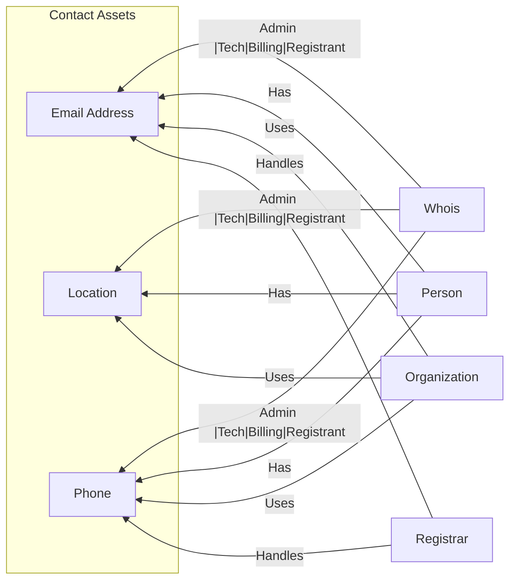

```mermaid
graph RL
    %% Main Incoming Relationships
    Whois
    Person
    Organization
    Registrar

    %% Contact Assets on the right side
    subgraph "Contact Assets"
        Email[Email Address]
        Location[Location]
        Phone[Phone]
    end

    %% Relationships
    Whois -- Admin |Tech|Billing|Registrant --> Email
    Whois -- Admin |Tech|Billing|Registrant --> Phone
    Whois -- Admin |Tech|Billing|Registrant --> Location
    
    Person -->|Has| Email
    Person -->|Has| Phone
    Person -->|Has| Location
    
    Organization -->|Uses| Email
    Organization -->|Uses| Phone
    Organization -->|Uses| Location

    Registrar -->|Handles| Email
    Registrar -->|Handles| Phone
```
