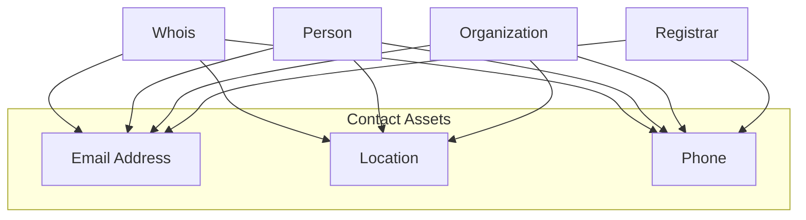

```mermaid
graph TD
    %% Main Incoming Relationships
    Whois
    Person
    Organization
    Registrar

    %% Contact Assets on the right side
    subgraph "Contact Assets"
        Email[Email Address]
        Location[Location]
        Phone[Phone]
    end

    %% Relationships
    Whois --> Email
    Whois --> Phone
    Whois --> Location
    
    Person --> Email
    Person --> Phone
    Person --> Location
    
    Organization --> Email
    Organization --> Phone
    Organization --> Location

    Registrar --> Email
    Registrar --> Phone
```
