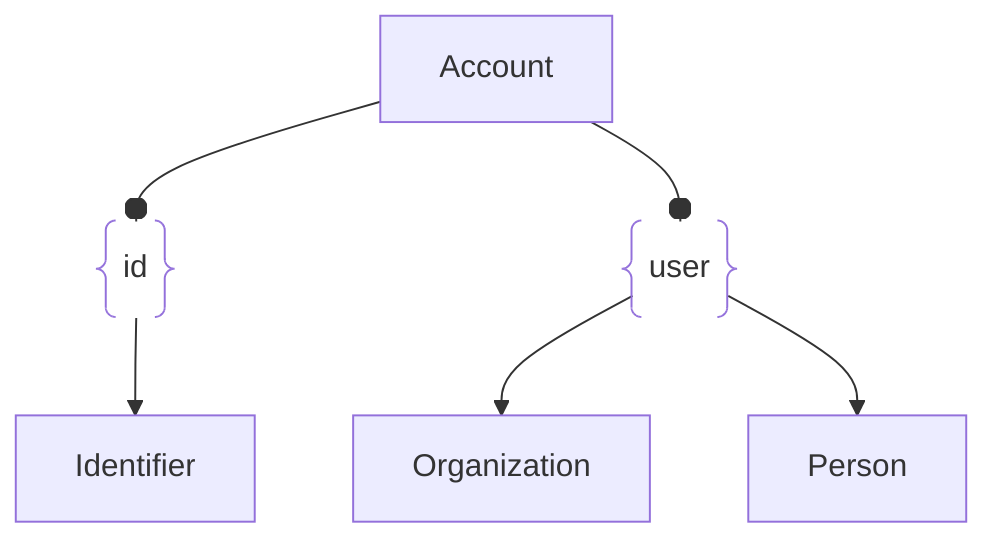

# :simple-owasp: Account

The `Account` asset type in the [OWASP](https://owasp.org) [Open Asset Model](https://github.com/owasp-amass/open-asset-model) (OAM) represents a digital or financial account associated with an organization, user, or service. This may include cloud service accounts, financial accounts, email or user login handles, and other forms of identity-linked accounts that hold operational, monetary, or access significance.

Each `Account` asset includes structured metadata describing its identity and lifecycle:

- **ID** – A globally unique identifier for the account within the graph.
- **Type** – The kind of account represented (e.g., `email`, `bank`, `cloud`, `user`, `subscription`).
- **Username** – The login handle, screen name, or identifier tied to the account (e.g., `admin@corp.com`, `acme-billing`).
- **Account Number** – An optional unique number assigned to the account (e.g., bank account or customer ID).
- **Balance** – Optional numeric value representing a monetary balance or credit (used primarily for financial contexts).
- **Active** – A boolean indicating whether the account is currently in use or retired.

- **Definition:** *An identity-linked asset that represents a digital, user, or financial account used to access or control resources across infrastructure or service environments.*

- **Purpose:** The Account asset plays a vital role in representing non-infrastructure access points—especially those tied to identity, privilege, and control.

Key use cases include:

- **Credential Discovery** – Modeling usernames or accounts found in source code, breach data, or service responses.
- **Privilege Mapping** – Associating accounts with specific services or roles in cloud or SaaS environments.
- **Exposure Attribution** – Tracing exposed keys, billing accounts, or cloud identities back to organizations.
- **Operational Monitoring** – Tracking stale or inactive accounts that may indicate shadow IT or abandoned assets.
- **Financial Context** – Enriching infrastructure or access graphs with business-relevant metadata like balances or customer IDs.

As modern infrastructure increasingly relies on cloud identities, tokens, and user-managed accounts, this asset type ensures these components are treated with the same rigor and visibility as traditional network assets.

- **Design Choice:** The design of the Account asset type is intentionally minimal, yet extensible:

- **Type-Driven Classification** – The account_type field enables generalized modeling (e.g., cloud, user, bank) while allowing tooling to define additional specificity as needed.
- **Dual-Use Fields** – By including both username and account_number, the model supports both identity-driven and numerically indexed account types (e.g., login-based vs. customer-ID-based).
- **Support for Financial Metadata** – The balance field anticipates modeling of assets where monetary value or usage limits play a role (e.g., billing accounts or quota-based services).
- **Lifecycle Awareness** – The active boolean enables visibility into the operational state of the account, useful for spotting dormant, disabled, or legacy identities.

This flexible schema supports ingestion from diverse data sources including cloud control planes, threat intelligence feeds, credential scanning tools, and financial systems, making the Account a powerful linking node between people, services, and infrastructure.

Modeling accounts as first-class assets enables reasoning about identity exposure, credential misuse, service abuse, and privilege relationships. Whether discovered via configuration files, leaked credentials, service enumeration, or third-party intelligence, `Account` assets play a key role in mapping the operational footprint and associated risks of an organization.

Account assets can be linked to services, users, or organizations through relations, enabling workflows such as credential exposure detection, service-to-user mapping, or analysis of abandoned or inactive accounts across cloud providers or infrastructure environments.

Accounts are identity-centric primitives that enrich the graph’s ability to reason about control, access, and exposure across digital systems.

## :material-account: Account Attributes

| Attributes            | Type        | Required    | Description   |
| :-------------------: | :---------: | :---------: | :------------ |
| `unique_id`           | string      | :material-check-decagram: | Unique identifier for the account within the model |
| `account_type`        | string      | :material-check-decagram: | Classification of the account (e.g., `cloud`, `bank`, `user`) |
| `username`            | string      | :material-checkbox-blank-circle-outline: | Login name, email, or screen name associated with the account |
| `account_number`      | string      | :material-checkbox-blank-circle-outline: | Optional numeric or alphanumeric account ID (e.g., `acct-1234`) |
| `balance`             | float       | :material-checkbox-blank-circle-outline: | Optional financial or credit balance |
| `active`              | boolean     | :material-checkbox-blank-circle-outline: | Whether the account is currently active |

## :material-account: Account Properties

| Property Type       | Property Name       | Description   |
| :-----------------: | :-----------------: | :------------ |
| [`SimpleProperty`](../properties/simple_property.md) | `last_monitored` | Tracks when a data source was last queried regarding this Account |
| [`SourceProperty`](../properties/source_property.md) | Source Plugin Name | Indicates that the specified data source discovered this Account |

## :material-account: Account Outgoing Relations

---

| Relation Type       | Relation Label     | Target Assets     | Description   |
| :-----------------: | :----------------: | :---------------: | :------------ |
| [`SimpleRelation`](../relations/simple_relation.md) | `id`   | [`Identifier`](./identifier.md) | Links the account to other discovered identifiers |
| [`SimpleRelation`](../relations/simple_relation.md) | `user` | [`Organization`](./organization.md), [`Person`](./person.md) | Links the account to known users that have access |

---

*© 2025 Jeff Foley — Licensed under Apache 2.0.*
