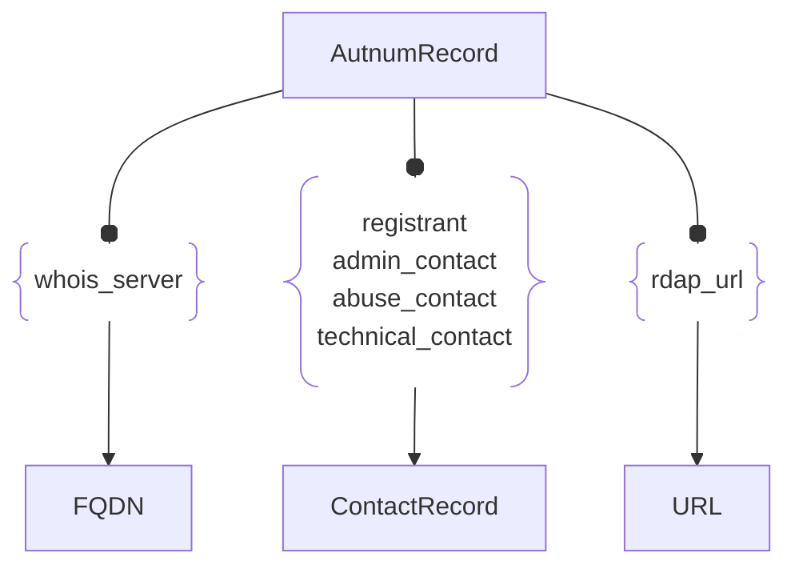

# :simple-owasp: AutnumRecord

The **AutnumRecord** asset type in the [OWASP](https://owasp.org) [Open Asset Model](https://github.com/owasp-amass/open-asset-model) (OAM) represents authoritative **registration data** for an Autonomous System (AS), as provided by Regional Internet Registries (RIRs) via RDAP or legacy WHOIS. This includes ownership and operational metadata related to an **Autonomous System Number (ASN)**—the numeric identifier used in BGP routing.

- **Definition:** An `AutnumRecord` contains parsed RDAP registration data about an ASN, including its number, handle, registered name, lifecycle dates, and optional status flags. It also includes the raw source text for auditing or secondary parsing.

- **Purpose:** Modeling AS registration data as a distinct asset allows analysts to pivot from infrastructure to **attribution**, understand who controls internet routing authority, and detect AS-level behavior changes (e.g., hijacks, acquisitions, multi-homing). It supports graph queries like “which ASNs are linked to a given organization?” or “what netblocks does a registered AS announce?”

- **Design Choice:** Like `DomainRecord`, the `AutnumRecord` includes both structured and unstructured fields, preserving original RDAP/WHOIS responses while enabling consistent graph modeling. Fields are optimized for operational monitoring and attribution while remaining tolerant to registry variability.

The AutnumRecord asset type enables attribution, tracking, and auditing of ASNs across the global routing system, serving as a critical bridge between technical infrastructure and organizational ownership.

## :material-file-cabinet: AutnumRecord Attributes

| Attributes       | Type              | Required | Description |
|:----------------:|:-----------------:|:--------:|:------------|
| `number`         | integer           | :material-check-decagram: | Autonomous System Number (ASN) |
| `handle`         | string            | :material-check-decagram: | Registry-specific handle (e.g., `AS15169`) |
| `name`           | string            | :material-check-decagram: | Name of the AS as registered (e.g., `GOOGLE`) |
| `created_date`   | string (ISO date) | :material-check-decagram: | Date the ASN was first registered |
| `updated_date`   | string (ISO date) | :material-check-decagram: | Last modification date of the registration |
| `status`         | array of strings  | :material-checkbox-blank-circle-outline: | Optional status flags |
| `whois_server`   | string            | :material-checkbox-blank-circle-outline: | RDAP/WHOIS server that served the registration data |
| `raw`            | string            | :material-checkbox-blank-circle-outline: | Original registration record text or RDAP JSON |

## :material-file-cabinet: AutnumRecord Properties

| Property Type | Property Name | Description |
|:-------------:|:-------------:|:------------|
| [`SimpleProperty`](../properties/simple_property.md) | `last_monitored` | Timestamp of the last time this record was updated or verified |
| [`SourceProperty`](../properties/source_property.md) | Source Plugin Name | Indicates which data source retrieved the registration |

## :material-file-cabinet: AutnumRecord Outgoing Relations

---

| Relation Type       | Relation Label     | Target Assets    | Description   |
| :-----------------: | :----------------: | :--------------: | :------------ |
| [`SimpleRelation`](../relations/simple_relation.md) | `whois_server` | [`FQDN`](./fqdn.md) | Links the ASN registration information with the correct WHOIS server |
| [`SimpleRelation`](../relations/simple_relation.md) | `registrant` | [`ContactRecord`](./contact_record.md) | Links the ASN registration information with registrant contact information |
| [`SimpleRelation`](../relations/simple_relation.md) | `admin_contact` | [`ContactRecord`](./contact_record.md) | Links the ASN registration information with admin contact information |
| [`SimpleRelation`](../relations/simple_relation.md) | `abuse_contact` | [`ContactRecord`](./contact_record.md) | Links the ASN registration information with contact information for abuse reporting |
| [`SimpleRelation`](../relations/simple_relation.md) | `technical_contact` | [`ContactRecord`](./contact_record.md) | Links the ASN registration information with contact information of technical personnel |
| [`SimpleRelation`](../relations/simple_relation.md) | `rdap_url` | [`URL`](./url.md) | Links the ASN registration information to its associated web page |

---

*© 2025 Jeff Foley — Licensed under Apache 2.0.*
