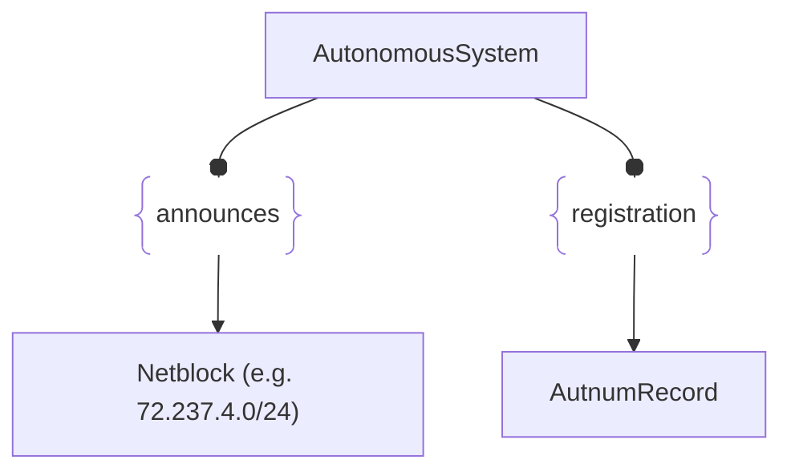

# :simple-owasp: AutonomousSystem

The `AutonomousSystem` is an asset type defined in the [OWASP](https://owasp.org) [Open Asset Model](https://github.com/owasp-amass/open-asset-model) (OAM) that represents a unique network entity on the global Internet, identified by an Autonomous System Number (ASN). These systems are managed by organizations—such as ISPs, cloud providers, enterprises, and academic institutions—that control a block of IP address space and operate a distinct routing policy.

Autonomous Systems are foundational elements of the Internet’s infrastructure. In the context of external attack surface management (EASM), they serve as a key attribution point between an organization and the IP address ranges it announces and operates. By modeling these as first-class assets, the OAM enables analysts and automation to reason about ownership, geography, provider relationships, and changes in network footprint.

Each `AutonomousSystem` asset includes:

- **ASN** – The unique numeric identifier assigned by a regional internet registry (RIR), such as `15169`.

The `AutonomousSystem` asset is often used as a root for discovering related IP ranges (`NetBlock` assets), establishing legal entity associations, or monitoring changes in Internet-facing infrastructure. It is also useful in tracking adversary infrastructure, attributing threat activity, and resolving the ownership of obscure or third-party hosted assets.

## :material-router-network: AutonomousSystem Attributes

| Attributes       | Type      | Required   | Description  |
| :--------------: | :-------: | :--------: | :----------- |
| `number`          | number | :material-check-decagram: | The unique Autonomous System Number assigned to the network |

## :material-router-network: AutonomousSystem Properties

| Property Type       | Property Name       | Description   |
| :-----------------: | :-----------------: | :------------ |
| [`SimpleProperty`](../properties/simple_property.md) | `last_monitored` | Tracks when a data source was last queried regarding this AutonomousSystem |
| [`SourceProperty`](../properties/source_property.md) | Source Plugin Name | Indicates that the specified data source discovered this AutonomousSystem |

## :material-router-network: AutonomousSystem Outgoing Relations

---

| Relation Type       | Relation Label     | Target Assets    | Description   |
| :-----------------: | :----------------: | :--------------: | :------------ |
| [`SimpleRelation`](../relations/simple_relation.md) | `announces` | [`Netblock`](./netblock.md) | Links an IPAddress to its DNS name used in PTR records |
| [`SimpleRelation`](../relations/simple_relation.md) | `registration` | [`AutnumRecord`](./autnum_record.md) | Links a ASN to its associated registration data |

---

*© 2025 Jeff Foley — Licensed under Apache 2.0.*