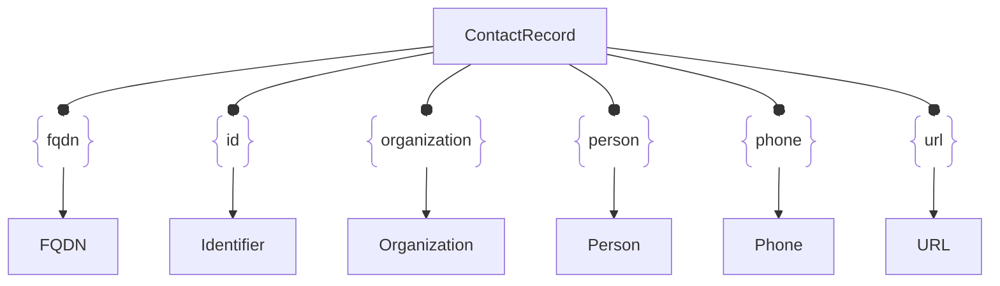

# :simple-owasp: ContactRecord

The **ContactRecord** asset serves as a connective entity that maintains a reliable audit trail of where contact information was discovered during the *attack surface intelligence* collection process. It plays a critical role in ensuring both flexibility and consistency within the [Open Asset Model](https://github.com/owasp-amass/open-asset-model), as it is uniformly applied wherever contact details are identified—regardless of the specific type of contact information uncovered. Because such information is often found in varied groupings, it's important to preserve the context in which each piece was associated. The **ContactRecord** makes this possible by capturing and storing the discovered contact data alongside its source location, maintaining their relationship within the model.

## :material-contacts: ContactRecord Attributes

| Attributes | Type | Required | Description |
| -------- | ---- | :--------: | ----------- |
| `discovered_at` | string | :material-check-decagram: | Unique URL or path to the contact information |

## :material-contacts: ContactRecord Outgoing Relations

---

| Relation Label | Relation Type | Assets | Description |
| :--------------: | :---------------: | :--------------: | :------------ |
| `fqdn` | [`SimpleRelation`](#simple_relation) | [`FQDN`](#fqdn) | Represents a FQDN discovered in the contact information |
| `id` | [`SimpleRelation`](#simple_relation) | [`Identifier`](#identifer) | Represents an ID (e.g. email address) in the contact information |
| `organization` | [`SimpleRelation`](#simple_relation) | [`Organization`](#organization) | Represents an organization name in the contact information |
| `person` | [`SimpleRelation`](#simple_relation) | [`Person`](#person) | Represents a person's name discovered with the contact information |
| `phone` | [`SimpleRelation`](#simple_relation) | [`Phone`](#phone) | Represents a phone number in the contact information |
| `url` | [`SimpleRelation`](#simple_relation) | [`URL`](#url) | Represents an URL discovered in the contact information |
