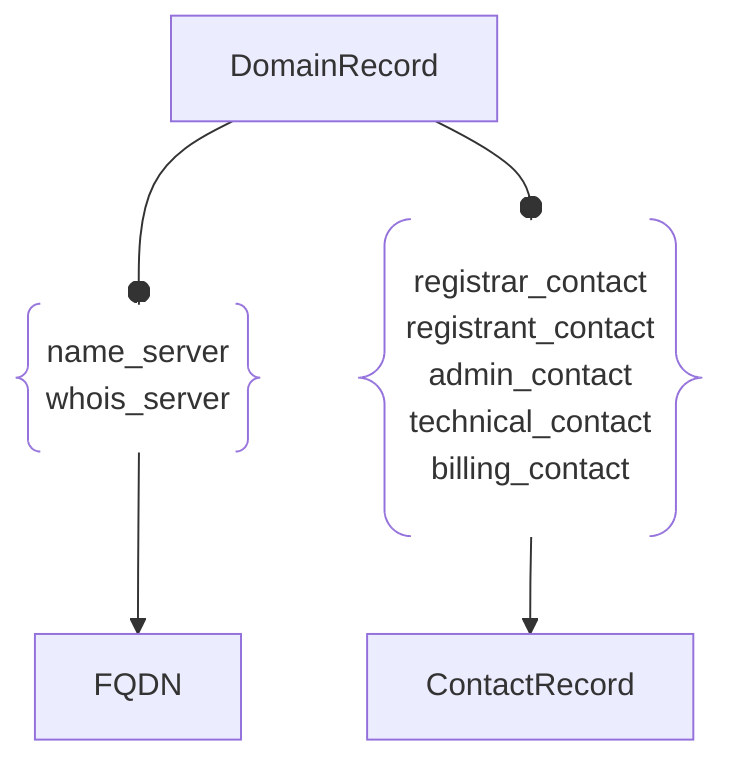

# :simple-owasp: DomainRecord

The **DomainRecord** asset type in the [OWASP](https://owasp.org) [Open Asset Model](https://github.com/owasp-amass/open-asset-model) (OAM) captures authoritative *registration* data for a domain name, as supplied by WHOIS, RDAP, or similar registry services. Domain registration facts are distinct from DNS‑resolution facts; they reveal **who controls a domain, when it was created, and under what status it currently operates**—all of which are vital to attribution, supply‑chain mapping, and domain‑lifecycle monitoring.

- **Definition:** A `DomainRecord` represents a single domain’s registration record (raw and parsed), including key lifecycle dates, status flags, registrar details, internationalisation fields, and a DNSSEC indicator.

- **Purpose:** Modeling registration data as a first‑class asset allows security teams to (1) link domains to legal entities and contacts, (2) detect newly registered or expiring domains, (3) follow ownership changes over time, and (4) correlate punycode / IDN variants that could be abused for impersonation.

- **Design Choice:** Keeping both *normalised* fields (e.g., `created_date`) **and** the original `raw` text preserves machine‑readable consistency while ensuring full auditability.  Optional fields make the structure tolerant of incomplete WHOIS responses, and the `status` array supports the many ICANN/ccTLD state strings without schema changes.

DomainRecords provide authoritative visibility into how domain names are registered, updated, and governed, making them critical for attribution, expiration monitoring, and organizational mapping within the external asset graph.

## :material-file-cabinet: DomainRecord Attributes

| Attributes        | Type                | Required | Description |
| :---------------: | :-----------------: | :------: | :---------- |
| `domain`          | string              | :material-check-decagram: | Fully‑qualified domain (e.g., `example.com`) |
| `punycode`        | string              | :material-checkbox-blank-circle-outline: | ASCII form of an IDN (e.g., `xn--exmple‑cua.com`) |
| `name`            | string              | :material-checkbox-blank-circle-outline: | Second‑level label (`example` in `example.com`) |
| `extension`       | string              | :material-checkbox-blank-circle-outline: | TLD (`com`, `org`, `io`, …) |
| `whois_server`    | string              | :material-checkbox-blank-circle-outline: | Hostname or URL of the authoritative WHOIS server |
| `created_date`    | string (date)       | :material-checkbox-blank-circle-outline: | First registration date |
| `updated_date`    | string (date)       | :material-checkbox-blank-circle-outline: | Last modification date |
| `expiration_date` | string (date)       | :material-checkbox-blank-circle-outline: | Scheduled expiration date |
| `status`          | array \<string\>    | :material-checkbox-blank-circle-outline: | Registry status codes (`clientTransferProhibited`, …) |
| `dnssec`          | boolean             | :material-checkbox-blank-circle-outline: | `true` if a DS record is present |
| `raw`             | string              | :material-checkbox-blank-circle-outline: | Unparsed WHOIS / RDAP text for auditing |
| `id`              | string              | :material-checkbox-blank-circle-outline: | Optional registry‑specific object ID |

## :material-file-cabinet: DomainRecord Properties

| Property Type | Property Name | Description |
| :-----------: | :-----------: | :---------- |
| [`SimpleProperty`](../properties/simple_property.md) | `last_monitored` | Timestamp of the most recent WHOIS/RDAP pull |
| [`SourceProperty`](../properties/source_property.md) | Source Plugin Name | Identifies which discovery module produced the record |

## :material-file-cabinet: DomainRecord Outgoing Relations

---

| Relation Type       | Relation Label     | Target Assets    | Description   |
| :-----------------: | :----------------: | :--------------: | :------------ |
| [`SimpleRelation`](../relations/simple_relation.md) | `name_server` | [`FQDN`](./fqdn.md) | Links the domain registration information with the correct DNS nameserver |
| [`SimpleRelation`](../relations/simple_relation.md) | `whois_server` | [`FQDN`](./fqdn.md) | Links the domain registration information with the correct WHOIS server |
| [`SimpleRelation`](../relations/simple_relation.md) | `registrar_contact` | [`ContactRecord`](./contact_record.md) | Links the domain registration information with registrar contact information |
| [`SimpleRelation`](../relations/simple_relation.md) | `registrant_contact` | [`ContactRecord`](./contact_record.md) | Links the domain registration information with registrant contact information |
| [`SimpleRelation`](../relations/simple_relation.md) | `admin_contact` | [`ContactRecord`](./contact_record.md) | Links the domain registration information with admin contact information |
| [`SimpleRelation`](../relations/simple_relation.md) | `technical_contact` | [`ContactRecord`](./contact_record.md) | Links the domain registration information with contact information of technical personnel |
| [`SimpleRelation`](../relations/simple_relation.md) | `billing_contact` | [`ContactRecord`](./contact_record.md) | Links the domain registration information with contact information of billing personnel |

---

*© 2025 Jeff Foley — Licensed under Apache 2.0.*
