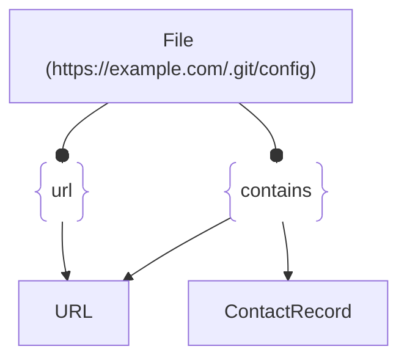

# :simple-owasp: File

The **File** asset type in the [OWASP](https://owasp.org) [Open Asset Model](https://github.com/owasp-amass/open-asset-model) (OAM) represents a file that is publicly accessible from the internet—typically retrieved via HTTP, HTTPS, or other remote protocols. This includes web-accessible files such as JavaScript libraries, PDF documents, configuration exports, or exposed archives.

- **Definition:** A `File` asset consists of a direct URL reference to a downloadable or inspectable file, with optional metadata such as file name and type. It serves as an abstraction for discrete, remotely hosted resources.

- **Purpose:** Exposed files often contain valuable signals for OSINT and security teams. Public-facing files may reveal application behavior (e.g., JavaScript logic), data leakage (e.g., exports, backups), infrastructure clues (e.g., `.env`, `.git/config`), or user-generated content (e.g., uploaded resumes, invoices). Modeling these files as assets enables targeted analysis, attribution, and monitoring.

- **Design Choice:** The `File` type is intentionally simple—centered on its URL—to support lightweight ingestion from crawlers, link resolvers, or passive intelligence feeds. Optional `name` and `type` fields allow for basic classification without requiring full content analysis or mime-type parsing during collection.

## :material-file-outline: File Attributes

| Attributes | Type   | Required | Description |
|:----------:|:------:|:--------:|:------------|
| `url`      | string | :material-check-decagram: | Fully qualified URL to the file (e.g., `https://example.com/.git/config`) |
| `name`     | string | :material-checkbox-blank-circle-outline: | Optional file name or basename extracted from the URL |
| `type`     | string | :material-checkbox-blank-circle-outline: | Optional file type or format hint (e.g., `pdf`, `js`, `zip`) |

## :material-file-outline: File Properties

| Property Type | Property Name | Description |
|:-------------:|:-------------:|:------------|
| [`SimpleProperty`](../properties/simple_property.md) | `last_monitored` | Tracks when a data source was last queried regarding this File |
| [`SourceProperty`](../properties/source_property.md) | Source Plugin Name | Indicates that the specified data source discovered this File |

## :material-file-outline: File Outgoing Relations

---

| Relation Type       | Relation Label     | Target Assets    | Description   |
| :-----------------: | :----------------: | :--------------: | :------------ |
| [`SimpleRelation`](../relations/simple_relation.md) | `url` | [`URL`](./url.md) | Links the location of the File into the greater graph |
| [`SimpleRelation`](../relations/simple_relation.md) | `contains` | [`ContactRecord`](./contact_record.md), [`URL`](./url.md) | Links content discovered in the File into the greater graph |

---

*© 2025 Jeff Foley — Licensed under Apache 2.0.*
