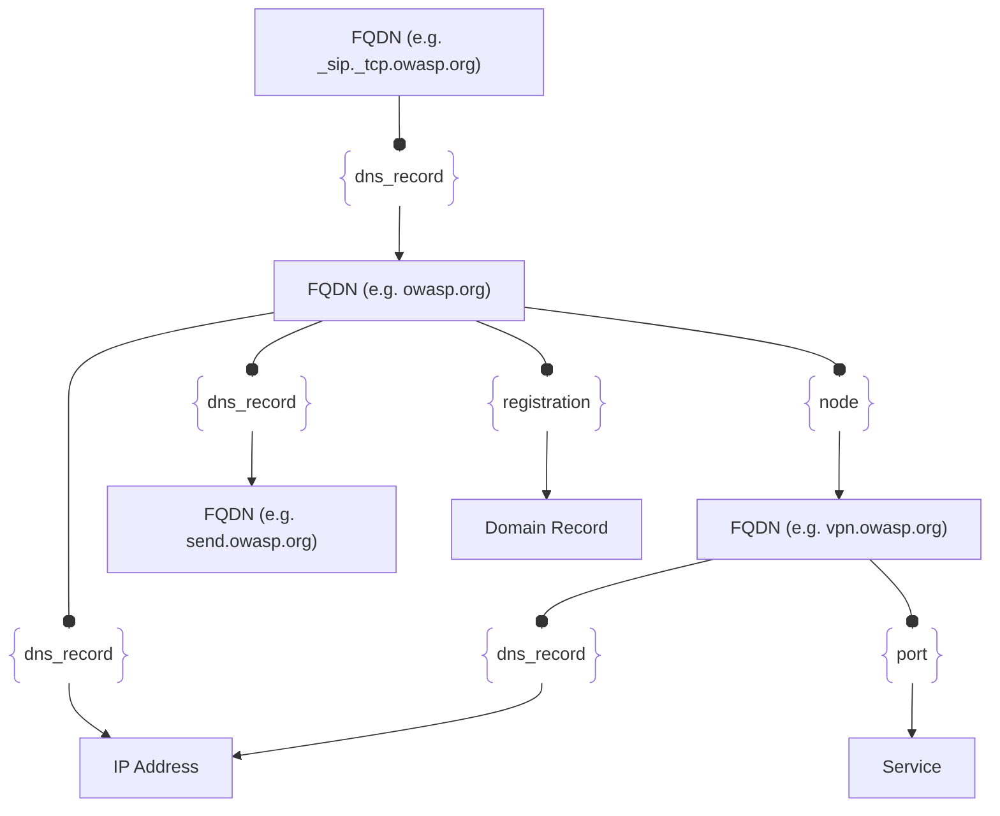

# :simple-owasp: FQDN

The *Fully Qualified Domain Name* (**FQDN**) asset represents a complete and unambiguous domain name that precisely identifies the location of a device or resource within the *Domain Name System (DNS)* hierarchy. FQDNs are foundational elements in *open-source intelligence (OSINT)* and are essential to building a thorough *attack surface intelligence* profile. Within the [Open Asset Model](https://github.com/owasp-amass/open-asset-model), these assets are organized along with their associated attributes and relationships, helping to uncover connections between otherwise disparate resources. This structured representation enables a more comprehensive and contextualized view of an organization’s digital footprint.

## :material-dns: FQDN Attributes

| Attributes | Type | Required | Description |
| -------- | ---- | :--------: | ----------- |
| `name` | string | :material-check-decagram: | Unique fully qualified domain name (e.g. www.example.com) |

## :material-dns: FQDN Outgoing Relations

---

| Relation Label | Relation Type | Assets | Description |
| :--------------: | :---------------: | :--------------: | :------------ |
| `dns_record` | [`BasicDNSRelation`](#basic_dns_relation) | [`FQDN`](#fqdn), [`IPAddress`](#ip_address) | Used for most RR types |
| `dns_record` | [`PrefDNSRelation`](#pref_dns_relation) | [`FQDN`](#fqdn) | Used for RR types that have a preference attribute |
| `dns_record` | [`SRVDNSRelation`](#srv_dns_relation) | [`FQDN`](#fqdn) | Used to support the SRV RR type |
| `node` | [`SimpleRelation`](#simple_relation) | [`FQDN`](#fqdn) | Links a DNS zone apex to nodes within the zone |
| `port` | [`PortRelation`](#port_relation) | [`Service`](#service) | Represents a port at the FQDN with a responding service |
| `registration` | [`SimpleRelation`](#simple_relation) | [`DomainRecord`](#domain_record) | Links a root domain to registration data |
