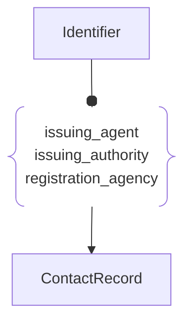

# :simple-owasp: Identifier

The **Identifier** asset type in the [OWASP](https://owasp.org) [Open Asset Model](https://github.com/owasp-amass/open-asset-model) (OAM) represents a structured, time-aware label used to uniquely reference an asset, entity, or object within or across systems.

- **Definition:** An `Identifier` includes a unique string (`unique_id`) and a human-readable or system-specific ID value (`id`), along with metadata about its type, lifecycle, and status. It is defined by the following attributes:
  - `unique_id`: A globally unique string representing the identifier instance (e.g., a UUID).
  - `id`: The actual identifier value, such as a hostname, domain name, serial number, or object ID.
  - `id_type`: A label describing the type of identifier (e.g., `arin`, `duns`, `email`, `lei`, etc.).
  - `creation_date` *(optional)*: When the identifier was created.
  - `update_date` *(optional)*: The most recent update timestamp.
  - `expiration_date` *(optional)*: When the identifier is expected to expire or become invalid.
  - `status` *(optional)*: The current state of the identifier (e.g., `active`, `expired`, `revoked`).

- **Purpose:** This asset type provides a standardized way to model references to assets or entities that exist in external systems, databases, or registries. It supports use cases such as identity tracking, configuration management, compliance audits, and historical analysis.

- **Design Choice:** By separating the identifier’s core value (`id`) from its metadata (such as timestamps and status), the model allows flexible and time-sensitive tracking of identifiers. This enables better integration with asset registries, IAM systems, and third-party feeds while preserving clarity in asset relationships.

In summary, the `Identifier` asset type captures structured, versioned references to external or internal identifiers, enabling the OAM to model asset identity and traceability across systems and time.

## :fontawesome-regular-id-card: Identifier Attributes

| Attributes        | Type      | Required   | Description  |
| :---------------: | :-------: | :--------: | :----------- |
| `unique_id`       | string | :material-check-decagram: | A globally unique string representing the identifier |
| `id`              | string | :material-check-decagram: | The actual identifier value, such as a serial number |
| `id_type`         | string | :material-checkbox-blank-circle-outline: | A label describing the type of identifier |
| `creation_date`   | string | :material-checkbox-blank-circle-outline: | When the identifier was created |
| `update_date`     | string | :material-checkbox-blank-circle-outline: | The most recent update timestamp |
| `expiration_date` | string | :material-checkbox-blank-circle-outline: | When the identifier is expected to become invalid |
| `status`          | string | :material-checkbox-blank-circle-outline: | The current state of the identifier |

## :fontawesome-regular-id-card: Identifier Properties

| Property Type       | Property Name       | Description   |
| :-----------------: | :-----------------: | :------------ |
| [`SimpleProperty`](../properties/simple_property.md) | `last_monitored` | Tracks when a data source was last queried regarding this Identifier |
| [`SourceProperty`](../properties/source_property.md) | Source Plugin Name | Indicates that the specified data source discovered this Identifier |

## :fontawesome-regular-id-card: Identifier Outgoing Relations

---

| Relation Type       | Relation Label     | Target Assets    | Description   |
| :-----------------: | :----------------: | :--------------: | :------------ |
| [`SimpleRelation`](../relations/simple_relation.md) | `registration_agency` | [`ContactRecord`](./contact_record.md.md) | Links a registration ID with the registering agency |
| [`SimpleRelation`](../relations/simple_relation.md) | `issuing_authority` | [`ContactRecord`](./contact_record.md) | Links an identifier with its issuing authority |
| [`SimpleRelation`](../relations/simple_relation.md) | `issuing_agent` | [`ContactRecord`](./contact_record.md) | Links an identifier with its issuing agent |
