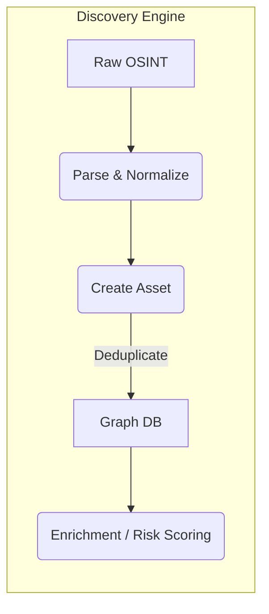

# :simple-owasp: Assets

In the [OWASP](https://owasp.org) [Open Asset Model](https://github.com/owasp-amass/open-asset-model), an asset represents any discrete, observable element in the external environment of an organization that holds security or operational relevance. Assets can range from technical resources like domain names and IP addresses to organizational constructs such as legal entities and brand names. What makes assets central to the model is that they serve as the primary objects of analysis—entities that can be discovered, attributed, linked, enriched, and ultimately assessed for risk. Each asset is uniquely identified, carries contextual metadata such as confidence and source of discovery, and participates in a web of typed relationships that form a dynamic, queryable graph of an organization's external footprint.

## :material-graph-outline: Why *Assets* Are the First‑Class Citizens

In the **Open Asset Model (OAM)**, *assets* are the atomic units of knowledge that describe an organization’s externally observable footprint.  Every other class in the model—attributes, properties, relations—exists to enrich or contextualize an asset.  By treating *everything discoverable* (from a DNS name to a cloud storage bucket) as an asset, we gain three strategic advantages:

1. **Uniform Vocabulary** – Analysts, tools, and automation pipelines can exchange data without bespoke translation layers.
2. **Composable Reasoning** – Graph analytics, enrichment, and risk scoring can be applied consistently because every node shares a common set of metadata fields (`id`, `confidence`, `source` …).
3. **Auditability** – Each asset retains a pointer to discovery provenance, making it trivial to reproduce findings or trace errors.

## :material-graph-outline: Asset Definition

> **Asset**: *An identifiable object—digital, network, or legal—that an organization owns, operates, or relies on and that can be observed from outside the security perimeter.*

An asset is **not** just a label; it is a self‑contained document that answers three questions:

1. **What is it?**
   A type‑specific schema (e.g., *FQDN*, *TLSCertificate*, *AutonomousSystem*).
2. **Where did it come from?**
   One or more *DiscoveryMethods* with timestamps and collection method.
3. **How certain are we?**
   A *confidence* score that downstream pipelines can use to gate actions.

## :material-graph-outline: Asset Taxonomy (Partial)

| Category               | Example Asset Types                                    | Typical Sources                       |
| ---------------------- | ------------------------------------------------------ | ------------------------------------- |
| **Network & DNS**      | `FQDN`, `IPAddress`, `AutonomousSystem`, `Netblock` | DNS enumeration, passive DNS, RDAP |
| **Products & Services**       | `Product`, `ProductRelease`, `Service`      | DNS, Port scanning, banner grabbing    |
| **Organization**       | `Organization`, `Account`, `FundsTransfer`                 | GLEIF, business registries       |
| **Identity & Contact** | `ContactRecord`, `Identifier`, `Phone`, `Location`         | TLS certs, WHOIS, RDAP, websites     |
| **Cryptographic**      | `TLSCertificate`                             | CT logs, public websites         |

*This list is intentionally open‑ended; community pull requests routinely add new asset types as technology evolves.*

## :material-graph-outline: Core Asset Attributes

Every asset embeds a minimal yet powerful set of metadata:

```json
type: "FQDN"
created_at: "2025-06-11"
last_seen: "2025-06-27"
```

Additional attributes are type‑specific—for instance, an `IPAddress` has the **address** field, while an `Organization` stores jurisdiction and registration numbers.

## :material-graph-outline: Relationships: Building the Graph

Assets rarely exist in isolation.  The model expresses **typed, directed edges** such as:

- `dns_record` – *FQDN* → *IPAddress*
- `contains` – *Netblock* → *IPAddress*
- `announces` – *AutonomousSystem* → *Netblock*
- `registration` – *Netblock* → *IPNetRecord*

These links turn the asset collection into a searchable **property graph**, enabling path‑finding queries like *“Which IP ranges host domains that roll up to Acme Corp’s legal entities?”*

## :material-graph-outline: Lifecycle in the Discovery Pipeline



1. **Parse & Normalize** – A discovery plugin converts evidence into the canonical asset schema.
2. **Create Asset** – New or updated asset documents are emitted with provenance.
3. **Deduplicate** – The graph layer merges assets sharing the same unique `key`.
4. **Enrichment** – Plugins append properties, such as alternative names, vulnerabilities, etc.
5. **Analytics & Export** – Downstream tools run path queries, generate reports, or feed alerting pipelines.

## :material-graph-outline: Quick Example: From Evidence to Asset

Imagine Amass extracts the email address *security@example.com* from the footer of *www.example.com*:

```text
Source URL: https://www.example.com
Evidence: "Contact us at security@example.com for vulnerabilities."
```

The *web scraper* module produces:

```json
type: "ContactRecord"
discovered_at: "http://www.example.com"
created_at: "2025-06-28"
last_seen: "2025-06-28"
```

An edge will be created between the **ContactRecord** and **Identifier** containing the email address (security@example.com). Future encounters with the same email address will reference the same asset in the graph.

## :material-graph-outline: Where to Go Next

Take a look at the pages where details are provided for each asset type.

- [Relations](../relations/index.md) – Overview of Relations in the Open Asset Model.
- [Properties](../properties/index.md) - Overview of a Property in the Open Asset Model.
- [Triples](../assetdb/triples.md) – Querying the graph with SPARQL‑inspired triples.
- [Assoc Tool](../framework_tools/assoc.md) – Using the command-line tool that queries the graph.

---

*© 2025 Jeff Foley — Licensed under Apache 2.0.*
