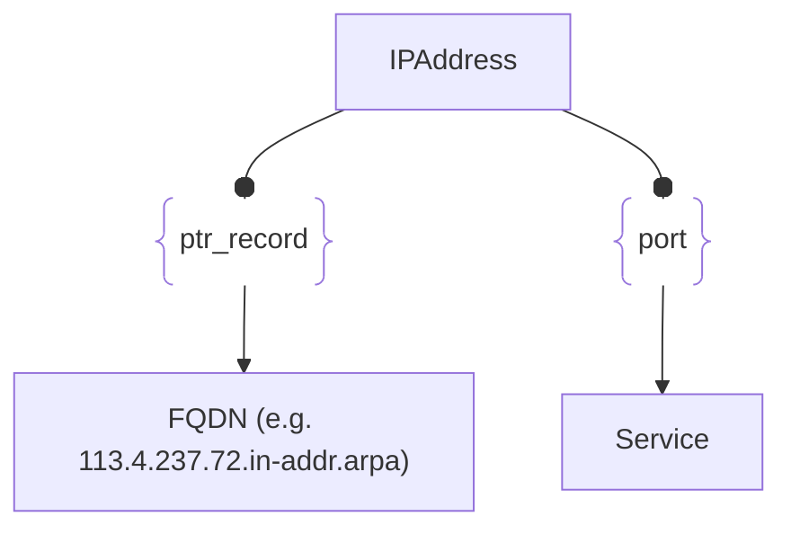

# :simple-owasp: IPAddress

The **IPAddress** asset type in the [OWASP](https://owasp.org) [Open Asset Model](https://github.com/owasp-amass/open-asset-model) (OAM) represents a concrete IP address and its associated protocol version, used to uniquely identify network endpoints in the model.

- **Definition:** An `IPAddress` asset holds two primary attributes:
  - `address`: The actual IP address in string format (e.g., `192.0.2.1` or `2001:db8::1`).
  - `type`: The IP protocol version, typically either `IPv4` or `IPv6`.

- **Purpose:** This asset type enables the explicit representation of individual IP addresses as first-class entities within the attack surface model. These can be linked to other assets (e.g., domains, ports, hosts) to show how infrastructure components are exposed or interconnected via the network.

- **Design Choice:** By separating the address from its protocol type, the model supports clear differentiation between IPv4 and IPv6, even when similar address representations exist. This structure also improves compatibility with analysis tools and threat modeling processes that treat IPv4 and IPv6 differently due to their behavior and reachability characteristics.

In summary, the `IPAddress` asset provides a simple yet precise way to model network identity, supporting both IPv4 and IPv6, and serving as a foundational building block for visualizing and analyzing network-layer exposure in the OAM.

## :material-ip-outline: IPAddress Attributes

| Attributes       | Type      | Required   | Description  |
| :--------------: | :-------: | :--------: | :----------- |
| `address` | string | :material-check-decagram: | Unique Internet Protocol address (e.g. 72.237.4.113) |
| `type` | string | :material-check-decagram: | The IP protocol version, typically either `IPv4` or `IPv6` |

## :material-ip-outline: IPAddress Properties

| Property Type       | Property Name       | Description   |
| :-----------------: | :-----------------: | :------------ |
| [`SimpleProperty`](../properties/simple_property.md) | `last_monitored` | Tracks when a data source was last queried regarding this IPAddress |
| [`SourceProperty`](../properties/source_property.md) | Source Plugin Name | Indicates that the specified data source discovered this IPAddress |

## :material-ip-outline: IPAddress Outgoing Relations

---

| Relation Type       | Relation Label     | Target Assets    | Description   |
| :-----------------: | :----------------: | :--------------: | :------------ |
| [`SimpleRelation`](../relations/simple_relation.md) | `ptr_record` | [`FQDN`](./fqdn.md) | Links an IPAddress to its DNS name used in PTR records |
| [`PortRelation`](../relations/port_relation.md) | `port` | [`Service`](./service.md) | Represents a port at the IPAddress with a responding service |

---

*© 2025 Jeff Foley — Licensed under Apache 2.0.*