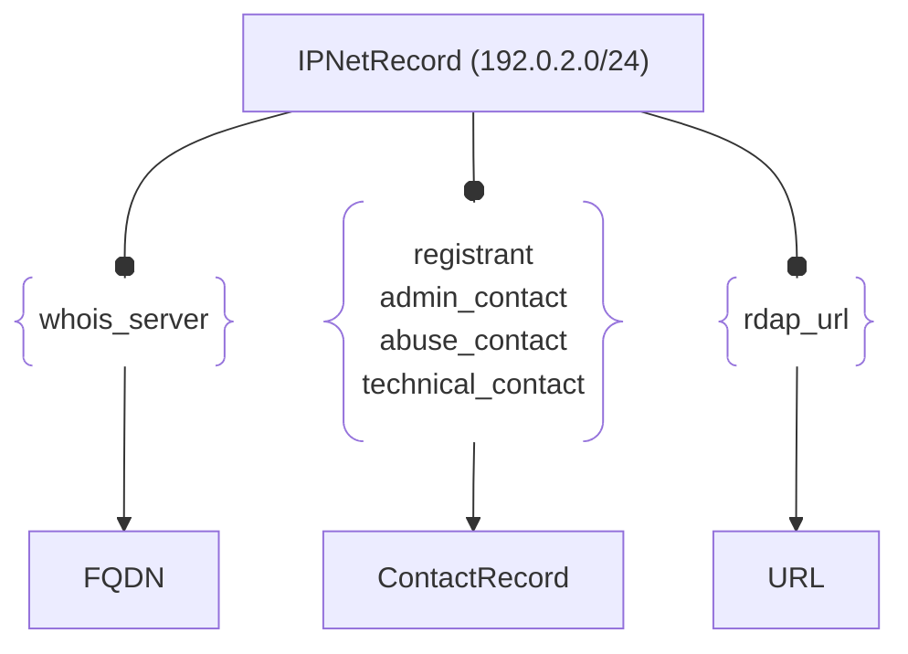

# :simple-owasp: IPNetRecord

The **IPNetRecord** asset type in the [OWASP](https://owasp.org) [Open Asset Model](https://github.com/owasp-amass/open-asset-model) (OAM) represents authoritative **registration data** for a block of IP addresses (IPv4 or IPv6), typically retrieved from a Regional Internet Registry (RIR) via the [RDAP](https://www.arin.net/resources/registry/whois/rdap/) protocol. This record captures the ownership, administrative, and organizational context of a given CIDR allocation.

- **Definition:** An `IPNetRecord` models a registered IP network block with accompanying metadata such as handle, range, status, country, and registration dates. It mirrors RDAP responses from RIRs like ARIN, RIPE, APNIC, AFRINIC, and LACNIC.

- **Purpose:** By modeling IP allocations as assets, `IPNetRecord` entries allow external infrastructure to be tied back to real-world entities. This is essential for **attribution**, **provider relationships**, and **BGP analysis**. It enables analysts to query: “Who owns this IP range?”, “What organization controls this infrastructure?”, or “Which AS announces this block?”

- **Design Choice:** The `IPNetRecord` structure preserves key fields from RDAP while ensuring they are queryable in graph form. CIDR blocks are expressed as typed network prefixes with explicit start and end addresses. Optional fields provide additional semantics for routing origin, delegation hierarchy, and jurisdictional scope.

The IPNetRecord asset enables infrastructure attribution, jurisdictional mapping, and inter-provider analysis within the OAM graph, anchoring raw IPs and services in a meaningful real-world context.

## :material-file-cabinet: IPNetRecord Attributes

| Attributes        | Type           | Required | Description |
|:-----------------:|:--------------:|:--------:|:------------|
| `cidr`            | CIDR prefix    | :material-check-decagram: | The registered network range in CIDR notation (e.g., `192.0.2.0/24`) |
| `handle`          | string         | :material-check-decagram: | RIR-assigned handle for the record |
| `name`            | string         | :material-check-decagram: | Name associated with the registration (e.g., organization or role) |
| `type`            | string         | :material-check-decagram: | Type of allocation (e.g., `ALLOCATED`, `ASSIGNED`) |
| `start_address`   | IP address     | :material-check-decagram: | First IP in the range |
| `end_address`     | IP address     | :material-check-decagram: | Last IP in the range |
| `created_date`    | string (ISO)   | :material-check-decagram: | Date the block was initially registered |
| `updated_date`    | string (ISO)   | :material-check-decagram: | Most recent modification date |
| `status`          | array of strings | :material-checkbox-blank-circle-outline: | Optional flags such as `active`, `allocated`, `legacy` |
| `whois_server`    | string         | :material-checkbox-blank-circle-outline: | RIR WHOIS or RDAP server used to retrieve the data |
| `method`          | string         | :material-checkbox-blank-circle-outline: | Discovery method (e.g., `RDAP`, `WHOIS`) |
| `country`         | string (ISO)   | :material-checkbox-blank-circle-outline: | Country code associated with the allocation (e.g., `US`) |
| `parent_handle`   | string         | :material-checkbox-blank-circle-outline: | Handle of the parent allocation, if applicable |
| `raw`             | string         | :material-checkbox-blank-circle-outline: | Raw RDAP or WHOIS response preserved for auditing |

## :material-file-cabinet: IPNetRecord Properties

| Property Type | Property Name | Description |
|:-------------:|:-------------:|:------------|
| [`SimpleProperty`](../properties/simple_property.md) | `last_monitored` | Timestamp of the last time this record was updated or verified |
| [`SourceProperty`](../properties/source_property.md) | Source Plugin Name | Indicates which data source retrieved the registration |

## :material-file-cabinet: IPNetRecord Outgoing Relations

---

| Relation Type       | Relation Label     | Target Assets    | Description   |
| :-----------------: | :----------------: | :--------------: | :------------ |
| [`SimpleRelation`](../relations/simple_relation.md) | `whois_server` | [`FQDN`](./fqdn.md) | Links the netblock registration information with the correct WHOIS server |
| [`SimpleRelation`](../relations/simple_relation.md) | `registrant` | [`ContactRecord`](./contact_record.md) | Links the netblock registration information with registrant contact information |
| [`SimpleRelation`](../relations/simple_relation.md) | `admin_contact` | [`ContactRecord`](./contact_record.md) | Links the netblock registration information with admin contact information |
| [`SimpleRelation`](../relations/simple_relation.md) | `abuse_contact` | [`ContactRecord`](./contact_record.md) | Links the netblock registration information with contact information for abuse reporting |
| [`SimpleRelation`](../relations/simple_relation.md) | `technical_contact` | [`ContactRecord`](./contact_record.md) | Links the netblock registration information with contact information of technical personnel |
| [`SimpleRelation`](../relations/simple_relation.md) | `rdap_url` | [`URL`](./url.md) | Links the netblock registration information to its associated web page |

---

*© 2025 Jeff Foley — Licensed under Apache 2.0.*
