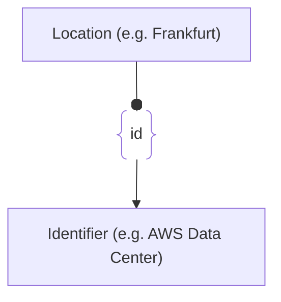

# :simple-owasp: Location

The **Location** asset type in the [OWASP](https://owasp.org) [Open Asset Model](https://github.com/owasp-amass/open-asset-model) (OAM) represents a physical, postal, or geo-administrative address where an entity, asset, or infrastructure component is situated. Modeling locations is essential for *physical security*, *compliance*, and *geo-contextual threat intelligence*.

* **Definition:** A `Location` asset encapsulates structured geographic and civic data elements such as street name, building number, city, province, country, and more. It is designed to express physical placement or registration information for various assets in the OAM.

* **Purpose:** By defining `Location` as a core asset, the model enables linkage between digital infrastructure and their physical contexts. This supports use cases like data residency enforcement, regional exposure analysis, and logistics around physical components of an attack surface.

* **Design Choice:** Each attribute within the `Location` asset is modeled with optionality in mind, allowing broad applicability — from a complete civic address to partial location data such as city-only or PO Box information. The inclusion of a `GLN` (Global Location Number) field aligns with standardized supply chain and logistics frameworks.

In summary, the `Location` asset type serves as a structured and flexible mechanism for tying assets to their real-world geographic presence — aiding in operational awareness, compliance mapping, and geospatial intelligence.

## :material-map-marker: Location Attributes

|     Attributes    |  Type  |          Required         | Description                                            |
| :---------------: | :----: | :-----------------------: | :----------------------------------------------------- |
|     `address`     | string | :material-check-decagram: | Full unstructured address (fallback or human-readable) |
|     `building`    | string | :material-checkbox-blank-circle-outline: | Building name or identifier             |
| `building_number` | string | :material-checkbox-blank-circle-outline: | Street number of the building           |
|   `street_name`   | string | :material-checkbox-blank-circle-outline: | Name of the street                      |
|       `unit`      | string | :material-checkbox-blank-circle-outline: | Apartment, suite, or unit number        |
|      `po_box`     | string | :material-checkbox-blank-circle-outline: | Post office box number                  |
|       `city`      | string | :material-check-decagram: | City or municipality name                              |
|     `locality`    | string | :material-checkbox-blank-circle-outline: | District, borough, or neighborhood name |
|     `province`    | string | :material-checkbox-blank-circle-outline: | State, province, or administrative div  |
|     `country`     | string | :material-checkbox-blank-circle-outline: | Country name (ISO recommended)          |
|   `postal_code`   | string | :material-checkbox-blank-circle-outline: | ZIP or postal code                      |
|       `gln`       |   int  | :material-checkbox-blank-circle-outline: | Global Location Number (GS1 standard)   |

## :material-map-marker: Location Properties

| Property Type       | Property Name       | Description   |
| :-----------------: | :-----------------: | :------------ |
| [`SimpleProperty`](../properties/simple_property.md) | `last_monitored` | Tracks when a data source was last queried regarding this Location |
| [`SourceProperty`](../properties/source_property.md) | Source Plugin Name | Indicates that the specified data source discovered this Location |

## :material-map-marker: Location Outgoing Relations

---

| Relation Type       | Relation Label     | Target Assets    | Description   |
| :-----------------: | :----------------: | :--------------: | :------------ |
| [`SimpleRelation`](../relations/simple_relation.md) | `id` | [`Identifier`](./identifier.md) | Links the `Location` alternative IDs, such as facility names |

---

*© 2025 Jeff Foley — Licensed under Apache 2.0.*
