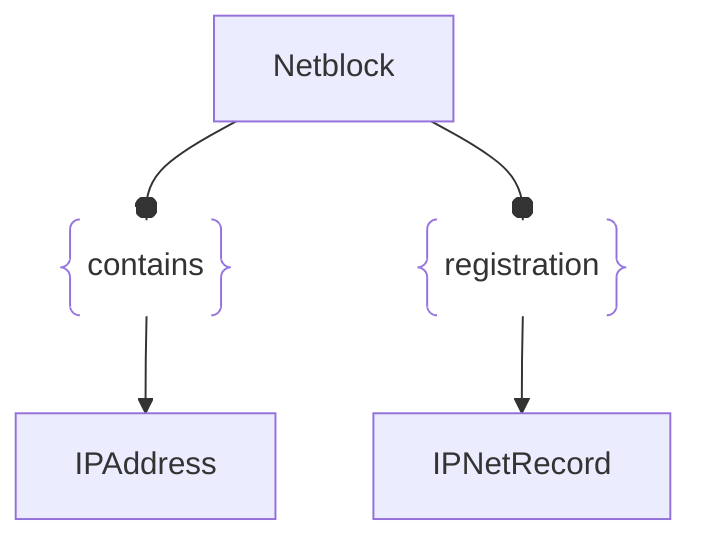

# :simple-owasp: Netblock

The **Netblock** asset type in the [OWASP](https://owasp.org) [Open Asset Model](https://github.com/owasp-amass/open-asset-model) (OAM) represents a contiguous range of IP addresses, typically expressed in CIDR notation and often associated with an Autonomous System (AS).

- **Definition:** A `Netblock` defines an IP range (e.g., `203.0.113.0/24` or `2001:db8::/32`) that encompasses many individual IP addresses. It usually reflects address space allocated to or announced by an Autonomous System and may represent organizational, geographic, or functional network boundaries.

- **Purpose:** This asset type enables modeling of large-scale network ownership and infrastructure grouping. By identifying which IP addresses fall within a specific `Netblock`, analysts can track organizational control, ISP allocation, or exposure zones across the internet or private networks. It's especially useful in asset discovery, threat attribution, and risk scoping.

- **Design Choice:** The `Netblock` provides an abstract, high-level view of address space without enumerating every IP address it contains. It can be related to specific `IPAddress` or `AutonomousSystem` assets through appropriate relations, enabling hierarchical and scalable modeling of internet-facing infrastructure.

In summary, the `Netblock` asset type captures ranges of IP addresses in a compact, structured way, supporting infrastructure mapping, ownership tracking, and contextual analysis of network exposure in the OAM.

## :fontawesome-solid-network-wired: Netblock Attributes

| Attributes       | Type      | Required   | Description  |
| :--------------: | :-------: | :--------: | :----------- |
| `cidr` | string | :material-check-decagram: | Contains the IP address range (e.g., `203.0.113.0/24`) |
| `type` | string | :material-check-decagram: | The IP protocol version, typically either `IPv4` or `IPv6` |

## :fontawesome-solid-network-wired: Netblock Properties

| Property Type       | Property Name       | Description   |
| :-----------------: | :-----------------: | :------------ |
| [`SimpleProperty`](../properties/simple_property.md) | `last_monitored` | Tracks when a data source was last queried regarding this Netblock |
| [`SourceProperty`](../properties/source_property.md) | Source Plugin Name | Indicates that the specified data source discovered this Netblock |

## :fontawesome-solid-network-wired: Netblock Outgoing Relations

---

| Relation Type       | Relation Label     | Target Assets    | Description   |
| :-----------------: | :----------------: | :--------------: | :------------ |
| [`SimpleRelation`](../relations/simple_relation.md) | `contains` | [`IPAddress`](./ip_address.md) | Links a Netblock to an IPAddress within the CIDR range |
| [`SimpleRelation`](../relations/simple_relation.md) | `registration` | [`IPNetRecord`](./ipnet_record.md) | Links a network to its associated registration data |

---

*© 2025 Jeff Foley — Licensed under Apache 2.0.*