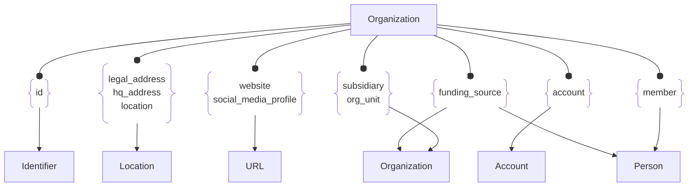

# :simple-owasp: Organization

The `Organization` asset type in the [OWASP](https://owasp.org) [Open Asset Model](https://github.com/owasp-amass/open-asset-model) (OAM) represents a real-world legal entity, such as a corporation, nonprofit, or government agency, that owns or operates digital infrastructure. This asset type is critical for enabling attribution, relationship mapping, and grouping of Internet-exposed resources under a common ownership structure.

By representing organizations explicitly, the model supports a wide range of use cases including legal entity discovery, supply chain risk analysis, and asset attribution in large or decentralized environments. This asset often serves as the root from which other assets, such as IP ranges, domain names, and TLS certificates, are discovered and associated.

Each `Organization` includes structured metadata such as:

- **ID** – A globally unique identifier for the organization within the graph.
- **Name** – A commonly used name for the organization (e.g., `Acme Corp`).
- **Legal Name** – The formally registered legal name (e.g., `Acme Corporation, Inc.`).
- **Founding Date** – The year or date when the organization was established.
- **Jurisdiction** – The legal or regulatory jurisdiction where the entity is registered (e.g., `US-DE` for Delaware, United States).
- **Registration ID** – An optional formal identifier from a national registry (e.g., a company number or DUNS number).
- **Industry** – A general classification of the organization’s primary business activity (e.g., `Cloud Services`, `Financial Technology`).
- **Target Markets** – Geographic or sectoral regions the organization primarily serves.
- **Active** – A boolean indicating whether the organization is currently operational.
- **Nonprofit** – A boolean indicating whether the entity is a nonprofit organization.
- **Headcount** – An estimate of the number of employees.

The `Organization` asset enables enrichment and correlation of digital infrastructure findings with publicly available business data. It plays a foundational role in external asset discovery workflows that begin from company metadata, such as legal names or registration information, and then pivot into technical assets like domains, netblocks, and services.

## :octicons-organization-24: Organization Attributes

| Attributes         | Type              | Required | Description |
|--------------------|-------------------|----------|-------------|
| `unique_id`        | string            | :material-check-decagram: | Unique identifier for the organization within the model |
| `name`             | string            | :material-check-decagram: | Common name used to identify the organization |
| `legal_name`       | string            | :material-checkbox-blank-circle-outline: | Official registered name of the organization |
| `founding_date`    | string (date)     | :material-checkbox-blank-circle-outline: | Date when the organization was founded (e.g., `2004-09-15`) |
| `jurisdiction`     | string            | :material-checkbox-blank-circle-outline: | Legal jurisdiction of incorporation (e.g., `US-DE`) |
| `registration_id`  | string            | :material-checkbox-blank-circle-outline: | Registered entity ID from a business registry |
| `industry`         | string            | :material-checkbox-blank-circle-outline: | Sector classification (e.g., `Cybersecurity`, `E-Commerce`) |
| `target_markets`   | array of strings  | :material-checkbox-blank-circle-outline: | Markets or regions the organization serves (e.g., `US`, `EU`) |
| `active`           | boolean           | :material-checkbox-blank-circle-outline: | Whether the organization is currently active |
| `non_profit`       | boolean           | :material-checkbox-blank-circle-outline: | Whether the organization is a nonprofit |
| `headcount`        | number            | :material-checkbox-blank-circle-outline: | Approximate number of employees |

## :octicons-organization-24: Organization Properties

| Property Type       | Property Name       | Description   |
| :-----------------: | :-----------------: | :------------ |
| [`SimpleProperty`](../properties/simple_property.md) | `last_monitored` | Tracks when a data source was last queried regarding this Organization |
| [`SourceProperty`](../properties/source_property.md) | Source Plugin Name | Indicates that the specified data source discovered this Organization |

## :octicons-organization-24: Organization Outgoing Relations

---

| Relation Type       | Relation Label     | Target Assets    | Description   |
| :-----------------: | :----------------: | :--------------: | :------------ |
| [`SimpleRelation`](../relations/simple_relation.md) | `id` | [`Identifier`](./identifier.md) | Links the organization to alternative identifiers |
| [`SimpleRelation`](../relations/simple_relation.md) | `legal_address` | [`Location`](./location.md) | Links the organization to its legal street address |
| [`SimpleRelation`](../relations/simple_relation.md) | `hq_address` | [`Location`](./location.md) | Links the organization to the street address of its headquarters |
| [`SimpleRelation`](../relations/simple_relation.md) | `location` | [`Location`](./location.md) | Links the organization to the street address of an alternative location |
| [`SimpleRelation`](../relations/simple_relation.md) | `subsidiary` | `Organization` | Links the organization to one of its child organizations |
| [`SimpleRelation`](../relations/simple_relation.md) | `org_unit` | `Organization` | Links the organization to one of its sectors or departments that is externally visible |
| [`SimpleRelation`](../relations/simple_relation.md) | `account` | [`Account`](./account.md) | Links the organization to one of its digital or financial accounts |
| [`SimpleRelation`](../relations/simple_relation.md) | `member` | [`Person`](./person.md) | Links the organization to one of its employees identified as a `Person` asset |
| [`SimpleRelation`](../relations/simple_relation.md) | `website` | [`URL`](./url.md) | Links the organization to its primary website or one dedicated to a product |
| [`SimpleRelation`](../relations/simple_relation.md) | `social_media_profile` | [`URL`](./url.md) | Links the organization to one of its social media profiles |
| [`SimpleRelation`](../relations/simple_relation.md) | `funding_source` | `Organization`, [`Person`](./person.md) | An `Organization` or `Person` that has invested in this company previously |

---

*© 2025 Jeff Foley — Licensed under Apache 2.0.*