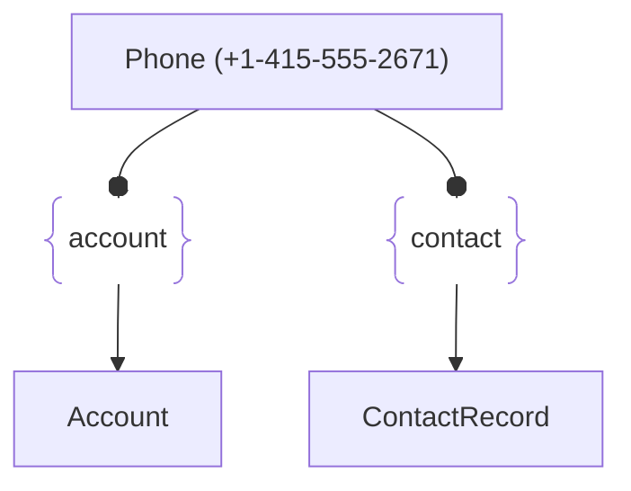

# :simple-owasp: Phone

The **Phone** asset type in the [OWASP](https://owasp.org) [Open Asset Model](https://github.com/owasp-amass/open-asset-model) (OAM) represents a structured phone number associated with a person, organization, or service. This includes landlines, mobile phones, and fax numbers, supporting international formats and extensions.

* **Definition:** A `Phone` asset includes raw and standardized (E.164) representations of phone numbers, along with metadata such as type (e.g., mobile or fax), country code, and optional extension.

* **Purpose:** Phone numbers are valuable in *OSINT investigations*, *phishing detection*, *social engineering risk analysis*, and mapping *communications infrastructure*. Modeling them as first-class assets allows for clear linkage to entities and tracing how they appear across datasets.

* **Design Choice:** The model uses the E.164 international standard to normalize phone numbers for global consistency. A `Type` field supports differentiation between regular, mobile, and fax numbers, enabling more nuanced analysis and relation modeling.

In summary, the `Phone` asset type brings structure and semantic clarity to phone number data, providing essential context for investigative and security workflows in the OAM.

## :material-phone: Phone Attributes

|    Attributes    |  Type  |          Required         | Description                                          |
| :--------------: | :----: | :-----------------------: | :--------------------------------------------------- |
|      `type`      | string | :material-checkbox-blank-circle-outline: | Type of phone number — `phone`, `fax`, or `mobile` |
|       `raw`      | string | :material-check-decagram: | Original, unprocessed string version of the number   |
|      `e164`      | string | :material-check-decagram: | Standardized E.164 format (e.g., `+14155552671`)     |
| `country_abbrev` | string | :material-checkbox-blank-circle-outline: | ISO 3166-1 alpha-2 country abbreviation (e.g., `US`) |
|  `country_code`  |   int  | :material-checkbox-blank-circle-outline: | Country dialing code (e.g., `1` for the US) |
|       `ext`      | string | :material-checkbox-blank-circle-outline: | Phone extension, if applicable (e.g., `x1234`) |

## :material-phone: Phone Properties

| Property Type       | Property Name       | Description   |
| :-----------------: | :-----------------: | :------------ |
| [`SimpleProperty`](../properties/simple_property.md) | `last_monitored` | Tracks when a data source was last queried regarding this Phone |
| [`SourceProperty`](../properties/source_property.md) | Source Plugin Name | Indicates that the specified data source discovered this Phone |

## :material-phone: Phone Outgoing Relations

---

| Relation Type       | Relation Label     | Target Assets    | Description   |
| :-----------------: | :----------------: | :--------------: | :------------ |
| [`SimpleRelation`](../relations/simple_relation.md) | `account` | [`Account`](./account.md) | Links the `Phone` number to a customer account |
| [`SimpleRelation`](../relations/simple_relation.md) | `contact` | [`ContactRecord`](./contact_record.md) | Links the `Phone` number to additional customer information |

---

*© 2025 Jeff Foley — Licensed under Apache 2.0.*
