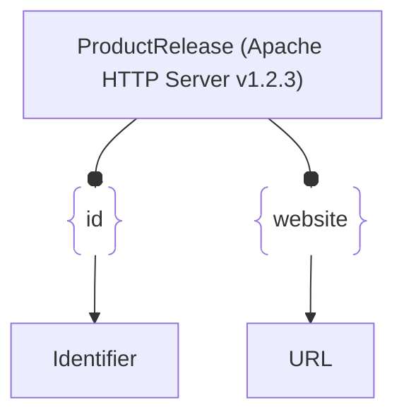

# :simple-owasp: ProductRelease

The **ProductRelease** asset type in the [OWASP](https://owasp.org) [Open Asset Model](https://github.com/owasp-amass/open-asset-model) (OAM) represents a specific version or release milestone of a technology product. This asset enables security analysts to track when a product version was introduced, helping to contextualize vulnerabilities, lifecycles, and compatibility considerations.

* **Definition:** A `ProductRelease` asset identifies a named version or release of a product (e.g., "v2.4.1", "2023 Q1 Patch"). It may optionally include the release date in a standardized format.

* **Purpose:** Tracking product releases is vital for assessing *vulnerability exposure*, *patch levels*, *software supply chain integrity*, and *asset compatibility*. This asset type supports fine-grained analysis of software deployment across environments.

* **Design Choice:** By separating a `ProductRelease` from the broader `Product` asset, the model supports a clean versioning structure that can evolve independently. This separation enables better temporal modeling and historical tracking of asset deployments and vulnerabilities.

In summary, the `ProductRelease` asset type provides version-level granularity for representing software and hardware products, enriching the asset graph for supply chain and lifecycle analysis.

## :material-package-variant: ProductRelease Attributes

|   Attributes   |  Type  |          Required         | Description                                               |
| :------------: | :----: | :-----------------------: | :-------------------------------------------------------- |
|     `name`     | string | :material-check-decagram: | Identifier of the release (e.g., `v1.2.3`, `2024.06`)     |
| `release_date` | string | :material-checkbox-blank-circle-outline: | Optional date the release became available (`YYYY-MM-DD`) |

## :material-package-variant: ProductRelease Properties

| Property Type       | Property Name       | Description   |
| :-----------------: | :-----------------: | :------------ |
| [`SimpleProperty`](../properties/simple_property.md) | `last_monitored` | Tracks when a data source was last queried regarding this ProductRelease |
| [`SourceProperty`](../properties/source_property.md) | Source Plugin Name | Indicates that the specified data source discovered this ProductRelease |
| [`VulnProperty`](../properties/vuln_property.md) | Vulnerability ID | Specifies a vulnerability associated with this ProductRelease |

## :material-package-variant: ProductRelease Outgoing Relations

---

| Relation Type       | Relation Label     | Target Assets    | Description   |
| :-----------------: | :----------------: | :--------------: | :------------ |
| [`SimpleRelation`](../relations/simple_relation.md) | `id` | [`Identifier`](./identifier.md) | Links the `ProductRelease` to other identifiers, such as a serial number |
| [`SimpleRelation`](../relations/simple_relation.md) | `website` | [`URL`](./url.md) | Links the `ProductRelease` to a website with additional information |

---

*© 2025 Jeff Foley — Licensed under Apache 2.0.*
