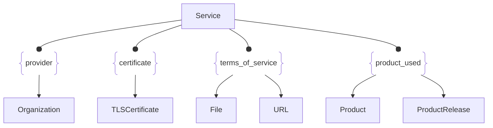

# :simple-owasp: Service

The **Service** asset type in the [OWASP](https://owasp.org) [Open Asset Model](https://github.com/owasp-amass/open-asset-model) (OAM) represents a **network-accessible service** discovered during external intelligence collection. This typically includes any server process that responded to a connection attempt on a known port—such as web servers, SSH daemons, mail servers, database listeners, and more.

- **Definition:** A `Service` asset captures metadata about a responding network service, including its type (e.g., `http`, `ssh`, `ftp`), the raw output from its initial response, and optionally a set of key-value `attributes` such as HTTP headers or protocol banners.

- **Purpose:** The `Service` asset allows the model to **anchor discovery events at the protocol layer**, enabling linkage between hosts (e.g., IP addresses or FQDNs), ports, and deeper contextual assets like `TLSCertificate` or `Product`. This supports questions like: “What is responding on port 443?”, “Which certificates are served from this endpoint?”, or “What headers are exposed by this HTTP server?”

- **Design Choice:** By treating services as first-class assets, OAM avoids overloading lower-level host or transport layers with application-layer metadata. This cleanly separates service-level observations and makes it easy to enrich, correlate, or reason over what’s actually deployed on a given interface.

The Service asset type anchors application-layer discovery to observable ports on internet-facing hosts, enabling technology fingerprinting, encryption analysis, and vulnerability enrichment across the OAM graph.

## :material-server-network: Service Attributes

| Attributes        | Type        | Required | Description |
|:-----------------:|:-----------:|:--------:|:------------|
| `unique_id`       | string      | :material-check-decagram: | Unique identifier for the service |
| `service_type`    | string      | :material-check-decagram: | Protocol or service label (e.g., `http`, `ssh`, `smtp`) |
| `output`          | string      | :material-checkbox-blank-circle-outline: | Raw response received from the service (e.g., HTTP banner, SSH version) |
| `output_length`   | integer     | :material-checkbox-blank-circle-outline: | Length of the captured `output` string |
| `attributes`      | object      | :material-checkbox-blank-circle-outline: | Key-value pairs extracted from the service response (e.g., headers, options) |

## :material-server-network: Service Properties

| Property Type       | Property Name       | Description   |
| :-----------------: | :-----------------: | :------------ |
| [`SimpleProperty`](../properties/simple_property.md) | `last_monitored` | Tracks when a data source was last queried regarding this Service |
| [`SourceProperty`](../properties/source_property.md) | Source Plugin Name | Indicates that the specified data source discovered this Service |

## :material-server-network: Service Outgoing Relations

---

| Relation Type       | Relation Label     | Target Assets    | Description   |
| :-----------------: | :----------------: | :--------------: | :------------ |
| [`SimpleRelation`](../relations/simple_relation.md) | `provider` | [`Organization`](./organization.md) | Links the service with the `Organization` hosting the server |
| [`SimpleRelation`](../relations/simple_relation.md) | `certificate` | [`TLSCertificate`](./tls_certificate.md) | Links the service with an associated TLS certificate |
| [`SimpleRelation`](../relations/simple_relation.md) | `terms_of_service` | [`File`](./file.md), [`URL`](./url.md) | Links the service with terms of service information |
| [`SimpleRelation`](../relations/simple_relation.md) | `product_used` | [`Product`](./product.md), [`ProductRelease`](./product_release.md) | Links the service to `Product` and versioning details |

---

*© 2025 Jeff Foley — Licensed under Apache 2.0.*
