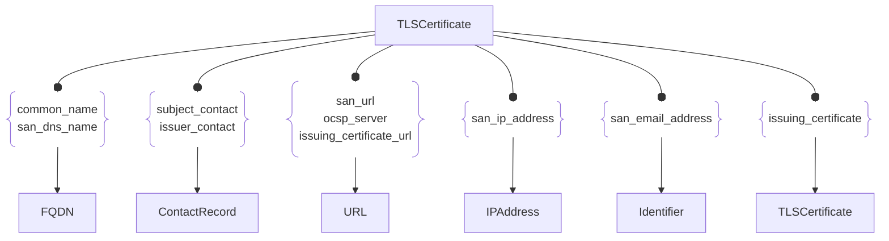

# :simple-owasp: TLSCertificate

The `TLSCertificate` asset type in the [OWASP](https://owasp.org) [Open Asset Model](https://github.com/owasp-amass/open-asset-model) (OAM) represents an X.509 certificate used to establish trust in TLS/SSL connections across Internet-facing services. TLS certificates are critical for encrypting traffic, authenticating services, and ensuring secure communication between clients and servers.

This asset captures detailed metadata about observed certificates, making it possible to track their usage across domains, detect misconfigurations, monitor expiration, and identify shared infrastructure through certificate reuse. By modeling certificates as first-class assets, the OAM enables graph-based analysis of cryptographic trust relationships and their ties to real-world entities and assets.

Each `TLSCertificate` includes key attributes such as:

- **Version** – The X.509 version number of the certificate.
- **Serial Number** – A unique identifier assigned by the certificate authority (CA).
- **Subject Common Name (CN)** – The primary identity this certificate claims to represent.
- **Issuer Common Name (CN)** – The identity of the CA that issued the certificate.
- **Validity Period** – Timestamps indicating when the certificate is valid (`not_before`) and when it expires (`not_after`).
- **Key Usage / Extended Key Usage** – Lists of intended purposes for the certificate (e.g., `DigitalSignature`, `ServerAuth`).
- **Signature Algorithm** – The algorithm used by the CA to sign the certificate.
- **Public Key Algorithm** – The algorithm used by the certificate's public key.
- **CA Flag** – A boolean flag indicating whether the certificate is a Certificate Authority.
- **CRL Distribution Points** – URLs where revocation information for the certificate may be retrieved.
- **Subject Key ID / Authority Key ID** – Identifiers used for verifying trust chains and certificate lineage.

This asset type is commonly used to enrich discovered web services, verify proper encryption practices, and detect certificate sharing across unrelated hosts (e.g., in cloud environments or phishing infrastructure). When linked with assets like `FQDN`, `IPAddress`, or `URL`, `TLSCertificate` helps establish strong associations between services and the organizations operating them.

## :material-certificate-outline: TLSCertificate Attributes

| Attributes                 | Type     | Required | Description |
|----------------------------|----------|----------|-------------|
| `version`                  | string   | :material-check-decagram: | The X.509 version of the certificate (e.g., `3`) |
| `serial_number`            | string   | :material-check-decagram: | Unique serial number assigned by the issuing CA |
| `subject_common_name`      | string   | :material-check-decagram: | The primary domain or identity the certificate is issued for |
| `issuer_common_name`       | string   | :material-check-decagram: | The Common Name (CN) of the issuing certificate authority |
| `not_before`               | string (datetime) | :material-check-decagram: | Start of the certificate’s validity period |
| `not_after`                | string (datetime) | :material-check-decagram: | Expiration of the certificate’s validity period |
| `key_usage`                | array of strings | :material-checkbox-blank-circle-outline: | Allowed cryptographic uses (e.g., `DigitalSignature`, `KeyEncipherment`) |
| `ext_key_usage`            | array of strings | :material-checkbox-blank-circle-outline: | Extended usage purposes (e.g., `ServerAuth`, `ClientAuth`) |
| `signature_algorithm`      | string   | :material-checkbox-blank-circle-outline: | Algorithm used to sign the certificate (e.g., `SHA256-RSA`) |
| `public_key_algorithm`     | string   | :material-checkbox-blank-circle-outline: | Algorithm used in the certificate’s public key (e.g., `RSA`, `ECDSA`) |
| `is_ca`                    | boolean  | :material-checkbox-blank-circle-outline: | Indicates if the certificate is a Certificate Authority |
| `crl_distribution_points`  | array of strings | :material-checkbox-blank-circle-outline: | URLs where revocation info can be found |
| `subject_key_id`           | string   | :material-checkbox-blank-circle-outline: | Identifier for the certificate’s public key |
| `authority_key_id`         | string   | :material-checkbox-blank-circle-outline: | Identifier for the public key used to sign this certificate |

## :material-certificate-outline: TLSCertificate Properties

| Property Type       | Property Name       | Description   |
| :-----------------: | :-----------------: | :------------ |
| [`SimpleProperty`](../properties/simple_property.md) | `last_monitored` | Tracks when a data source was last queried regarding this TLSCertificate |
| [`SourceProperty`](../properties/source_property.md) | Source Plugin Name | Indicates that the specified data source discovered this TLSCertificate |

## :material-certificate-outline: TLSCertificate Outgoing Relations

---

| Relation Type       | Relation Label     | Target Assets    | Description   |
| :-----------------: | :----------------: | :--------------: | :------------ |
| [`SimpleRelation`](../relations/simple_relation.md) | `common_name` | [`FQDN`](./fqdn.md) | Links the certificate common name to the `FQDN` asset with that DNS name |
| [`SimpleRelation`](../relations/simple_relation.md) | `subject_contact` | [`ContactRecord`](./contact_record.md) | Links the certificate to subject contact information |
| [`SimpleRelation`](../relations/simple_relation.md) | `issuer_contact` | [`ContactRecord`](./contact_record.md) | Links the certificate to issuer contact information |
| [`SimpleRelation`](../relations/simple_relation.md) | `san_dns_name` | [`FQDN`](./fqdn.md) | Links the certificate to `FQDN` assets found in the Subject Alternative Name (SAN) field |
| [`SimpleRelation`](../relations/simple_relation.md) | `san_email_address` | [`Identifier`](./identifier.md) | Links the certificate to `Identifier` assets found in the Subject Alternative Name (SAN) field |
| [`SimpleRelation`](../relations/simple_relation.md) | `san_ip_address` | [`IPAddress`](./ip_address.md) | Links the certificate to `IPAddress` assets found in the Subject Alternative Name (SAN) field |
| [`SimpleRelation`](../relations/simple_relation.md) | `san_url` | [`URL`](./url.md) | Links the certificate to `URL` assets found in the Subject Alternative Name (SAN) field |
| [`SimpleRelation`](../relations/simple_relation.md) | `issuing_certificate` | `TLSCertificate` | Links a certificate to the issuing `TLSCertificate` used for signing |
| [`SimpleRelation`](../relations/simple_relation.md) | `issuing_certificate_url` | [`URL`](./url.md) | The `URL` asset where the issuing `TLSCertificate` can be found |
| [`SimpleRelation`](../relations/simple_relation.md) | `ocsp_server` | [`URL`](./url.md) | The OCSP responder that can provide status information regarding the validity of a digital certificate |
