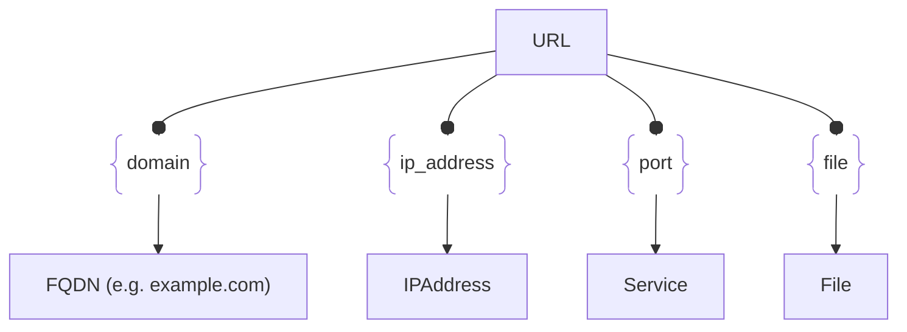

# :simple-owasp: URL

The `URL` asset type is part of the [OWASP](https://owasp.org) [Open Asset Model](https://github.com/owasp-amass/open-asset-model) (OAM) and represents a fully qualified web resource identifier. This asset captures essential information about a Uniform Resource Locator, including its structure, classification, and the context in which it was discovered or used.

URLs are a central component in external-attack surface assessments, as they often map directly to web applications, APIs, or other internet-facing services. Modeling URLs as first-class assets enables automated analysis, correlation with certificates, subdomain enumeration, and vulnerability scanning workflows.

Each `URL` asset includes the following attributes:

- **Raw URL** - The raw and unprocessed URL originally collected.
- **Scheme** – The protocol used (e.g., `http`, `https`).
- **Username** - The username used in HTTP basic authentication.
- **Password** - The password used in HTTP basic authentication.
- **Host** – The domain or IP address portion (e.g., `example.com`).
- **Port** – Optional—explicit port if non-standard (e.g., `8080`).
- **Path** – The resource path on the host (e.g., `/login`).
- **Options** – Extra options used while connecting.
- **Fragment** – Optional—anchor reference within the resource (e.g., `#section`).

By representing URLs with a dedicated asset structure, OAM supports detailed analysis of web-facing infrastructure—like identifying TLS mismatches, linking subdomains to specific applications, flagging hosts with dynamic or query-based endpoints, and auditing for insecure or deprecated schemes.

This asset type plays a key role in workflows such as subdomain takeover detection, API fingerprinting, redirect chain mapping, and vulnerability assessment pipelines.

## :octicons-browser-24: URL Attributes

| Attributes       | Type   | Required | Description |
|------------------|--------|----------|-------------|
| `url`            | string | :material-check-decagram: | The raw and unprocessed URL originally collected |
| `scheme`         | string | :material-check-decagram: | Protocol used in the URL (e.g., `http`, `https`) |
| `username`       | string | :material-checkbox-blank-circle-outline: | The username used in HTTP basic authentication |
| `password`       | string | :material-checkbox-blank-circle-outline: | The password used in HTTP basic authentication |
| `host`           | string | :material-check-decagram: | Domain name or IP address (e.g., `example.com`) |
| `port`           | number | :material-checkbox-blank-circle-outline: | Optional non-standard port (e.g., `8443`) |
| `path`           | string | :material-checkbox-blank-circle-outline: | The URL path component (e.g., `/admin`) |
| `options`        | string | :material-checkbox-blank-circle-outline: | Extra options used while connecting |
| `fragment`       | string | :material-checkbox-blank-circle-outline: | Optional fragment identifier (e.g., `#section`) |

## :octicons-browser-24: URL Properties

| Property Type       | Property Name       | Description   |
| :-----------------: | :-----------------: | :------------ |
| [`SimpleProperty`](../properties/simple_property.md) | `last_monitored` | Tracks when a data source was last queried regarding this URL |
| [`SourceProperty`](../properties/source_property.md) | Source Plugin Name | Indicates that the specified data source discovered this URL |

## :octicons-browser-24: URL Outgoing Relations

---

| Relation Type       | Relation Label     | Target Assets    | Description   |
| :-----------------: | :----------------: | :--------------: | :------------ |
| [`SimpleRelation`](../relations/simple_relation.md) | `domain` | [`FQDN`](./fqdn.md) | Links the URL to the domain name equal to the `host` attribute |
| [`SimpleRelation`](../relations/simple_relation.md) | `ip_address` | [`IPAddress`](./ip_address.md) | Links the URL to the IP address equal to the `host` attribute |
| [`PortRelation`](../relations/port_relation.md) | `port` | [`Service`](./service.md) | Represents the port that served up content for this URL |
| [`SimpleRelation`](../relations/simple_relation.md) | `file` | [`File`](./file.md) | Links the URL to the file that was served up at this location |

---

*© 2025 Jeff Foley — Licensed under Apache 2.0.*
